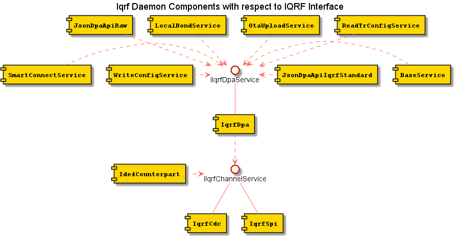

# Software design [#18](https://gitlab.iqrfsdk.org/gateway/iqrf-daemon/issues/18)

## 1 Component design

Software design is based on [Shape](https://github.com/logimic/shape) component framework.
The framework itself is just a glue to put all components together. However it allows flexible adding of other features or redesign existing.  The business logic itself is implemented in components described in this document.
The framework is described in: [Shape/README.md](https://github.com/logimic/shape/blob/master/README.md). It follows basic principals as defines by these terms used in next text

**Module** is distributable software in form of shared library. Includes components data classes and logically merges related SW parts.

**Interface** is pure virtual (abstract) class containing methods (functions). Used parameters should be general not exposing implementation details.

**Component** is class which implements Interface. There can be more components implementing the same Interface. E.g. component logging to file and component logging into database. Both can implement the same Interface. Component may use other Interfaces implemented by other Components.

**Component Instance** is an object of a component created by the component constructor. Number of created Component Instances depends on an application configuration. E.g. file logging component can have three instances, one for critical errors, second for debug level and third for a specific component.

**Provided Interface** is running Component Instance implementing the Interface published to be used.

**Required Interface** is published placeholder for required Interface. If a Component Instance wants to use an Interface it publish the placeholder.

**Attach Interface** is delivering Provided Interface to Required Interface placeholder.

**Detach Interface** is withdrawal of Provided Interface to Required Interface placeholder.

**Interface Cardinality** is SINGLE or MULTIPLE. It means Required Interface instance can be attached just once or all instantiated Interfaces can be attached.

**Interface Optionality** is UNREQUIRED or MANDATORY. It means all MANDATORY Interfaces have to be attached.

**Interface Target** is UNREQUIRED or MANDATORY. It means all MANDATORY Interfaces have to be attached.

**Activate** is a Component Instance state when all MANDATORY Required Interfaces were attached and the instance is set by Shape to normal operation.

**Dectivate** is a Component Instance state when some of MANDATORY Required Interface was detached and the instance is set by Shape to stop normal operation.

**Service** is represented by its Interface. Provides service like doing command, send data, parse data, calculate data, registering call-back, etc. Service is a published Interface (Provided or Required) within Shape framework.

## 2 Components with respect to Async API

Description of components processing messages received/sent via Async API

### Interfaces
#### IMessagingService Interface
Is abstraction of specific messaging protocol
- send message (address, message)
- register message handler (handlerId, handleFunction)
- get messaging ID (string) 
- handleFunction(address, message)

#### IMessagingSplitterService
Is abstraction of messaging splitter. Incomming address or message is preparsed and the message is routed to proper handler according registered topics. When a message (response) is sent an implementation has to assure that it is routed back to proper messaging according messagingId 
- send message (messagingId, address, message)
- register message handler (handlerId, vector<topic>, handleFunction)
- handleFunction(messagingId, address, message) 

#### ISchedulerService
Provides Interface to Scheduler component
- Add periodic task (in seconds) for client id
- Add task with cron syntax for client id
- Get task by task id
- Remove task by task id
- List all tasks for client id
- Remove all tasks for client id

### Components
#### LwsMessaging
Implements IMessagingService Interface via Websockets protocol

#### MqttMessaging
Implements IMessagingService Interface via MQTT protocol

#### MqMessaging
Implements IMessagingService Interface via inter-process communication

#### JsonHub
It uses Required Interface IMessagingService to register a handler processing incoming request messages. JsonHub preparses the request messages to get a key controlling where to route the next processing. It implements IMessagingSplitterService. A users of the interface is selected according the key and registered handler of the user is called. When the processing is finished the user sends back a response message. The response message is send according messagingId parameter. 

#### JsonEmbedPer
This component is responsible for handling requests messages to perform an action with an embedded periphery as e.g. blink LED or switch IO. It seems appropriate to split it to more components in implementation as some embedded periphery are complex (FRS) and dedicated components may be easily maintained and implemented in parallel by more developers independently.

#### JsonStdDev
This component is responsible for handling requests messages to perform an action with Standard Devices. It seems appropriate to split it to more components in implementation.

#### JsonNtwMgm
This component is responsible for handling requests messages to perform an action with Network mamagement. It seems appropriate to split it to more components in implementation.

#### JsonCfgMgm
This component is responsible for handling requests messages to perform an action with Configuration mamagement. Incoming configurations are handled via Shape Configuration Service

#### JsonSched
This component is responsible for handling requests messages to schedule tasks. The messages are in form of requests messages as it would be sent directly but wrapped in a scheduling envelope controlling postponing, periodicity, etc. JsonSched uses IScheduler interface to schedule the tasks. When it is fired by Scheduler JsonSched uses Provided Interface IMessaging to send wrapped request message via JsonHub to dedicated message handling component.

## 3 Components with respect to DPA

Description of components processing DPA messages 

## 4 Components with respect to IQRF Repository

Description of components interacting with IQRF Repository

