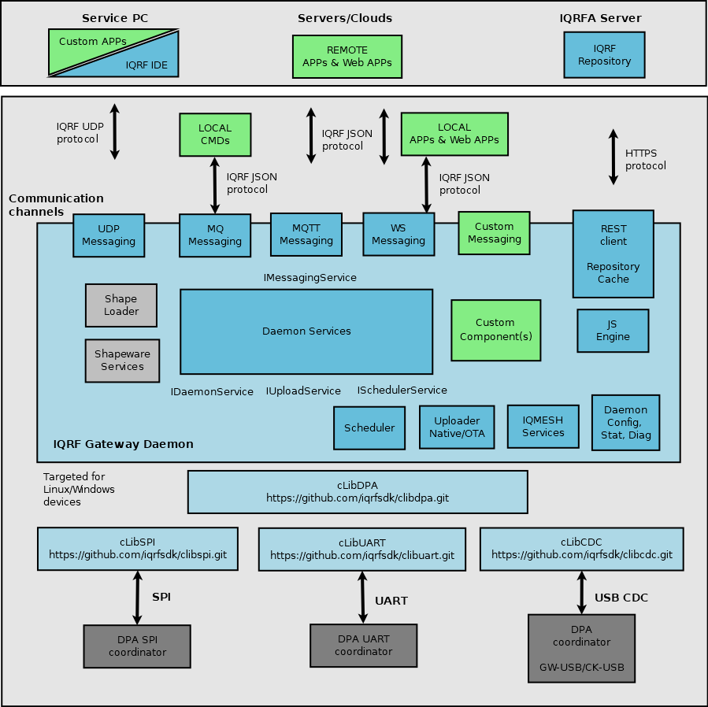

# IQRF Gateway Daemon - iqrfgd

Open-source components for building IQRF gateway.

The IQRF gateway-daemon project provides open-source components for building IQRF gateways. 
Together they form ready-to-use solution, including an user-friendly 
[web-interface](https://gitlab.iqrf.org/open-source/iqrf-gateway-webapp).
Components can be extended or added based on the project requirements. All components 
are licenced under Apache Licence 2.0 and can be used for commercial purposes.

## Documentation

https://docs.iqrf.org/iqrf-gateway

## Overview

## Architecture

## Acknowledgement

This project is implemented with financial support from the state budget through [the Ministry of Industry and Trade of the Czech Republic](https://www.mpo.cz/) in [the TRIO program](https://starfos.tacr.cz/cs/project/FV40132).
