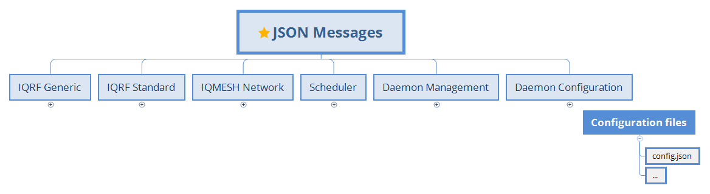

# IQRF Gateway Daemon - iqrfgd

Open-source components for building IQRF gateway.

The IQRF gateway-daemon project provides open-source components for building IQRF gateways. 
Together they form ready-to-use solution, including an user-friendly web-interface. 
Components can be extended or added based on the project requirements. All components 
are licenced under Apache Licence 2.0 and can be used for commercial purposes.

## Documentation

https://docs.iqrfsdk.org/iqrf-gateway-daemon

## Overview

### API

### Architecture

