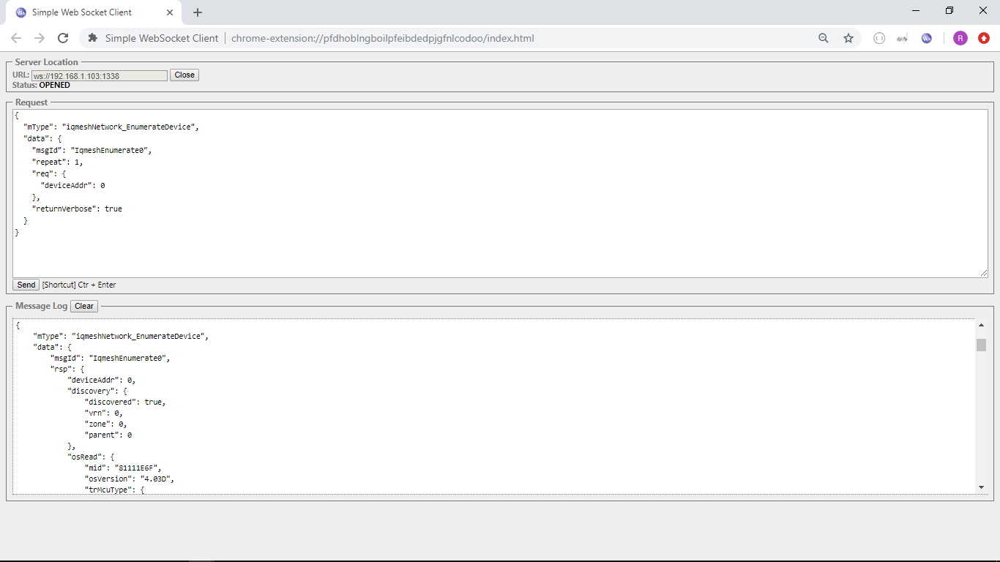

# FRC & Sleep

An efficient way to gather bits (2b), bytes (1, 2, 4B) from the network with ability to put nodes 
into sleep in between in order to save battery energy.

Complete set of IQRF JSONs for the gateway to realize the scenario are provided. 

We use following HW:

* 3x https://iqrf.org/products/transceivers/tr-72d 
* 2x https://iqrf.org/products/development-tools/development-kits/dk-eval-04a
* 2x https://iqrf.org/products/development-tools/development-kits/ddc-se-01

* 1x https://iqrf.org/products/development-tools/development-kits/kon-rasp-01
* 1x https://www.raspberrypi.org/products/raspberry-pi-3-model-b/

## Step 1 - Preparation

### IQRF Modules 

How to get ready TR modules, please refer to [how-to-start](https://www.iqrf.org/support/how-to-start).
Get ready 2x TRs as DPA Node with custom handler uploaded and enabled for DDC-SE-01 and 1x TR as DPA 
Coordinator. 

Bonding DPA nodes to DPA coordinator will be shown using IQRF JSON reqs.

### IQRF Gateway

How to build IQRF Gateway from your RPI board, please refer to [iqrf-gateway-daemon](https://docs.iqrf.org/iqrf-gateway-daemon/).

You can use [iqrf-gateway-webapp](https://docs.iqrf.org/iqrf-gateway-webapp/) to ease the configuration
task and also make sure that you established communication with DPA coordiantor e.g. sending DPA cmd LEDR 
ON to coordinator via http://webapp-ip/iqrfnet/send-raw/. 

### Other tools

We use Simple WebSocket Client for Chrome to send/receive IQRF JSONs to/from the gateway.

## Step 2 - Network management

**It is a good practice to start from clean state.**

* 2A - Clear coordinator memory

  * [iqrfEmbedCoordinator_ClearAllBonds-request.json](1-network-management/iqrfEmbedCoordinator_ClearAllBonds-request.json)
  * [iqrfEmbedCoordinator_ClearAllBonds-response.json](1-network-management/iqrfEmbedCoordinator_ClearAllBonds-response.json)

* 2B - Confirm clean state

  * [iqrfEmbedCoordinator_BondedDevices-request.json](1-network-management/iqrfEmbedCoordinator_BondedDevices-request.json)
  * [iqrfEmbedCoordinator_BondedDevices-response.json](1-network-management/iqrfEmbedCoordinator_BondedDevices-response.json)

* 2C - Change coordinator configuration

  **It is good practice to have rxFilter=5 at the gateway. We also need to have FRC enabled at the coordinator.**

  * [iqmeshNetwork_WriteTrConf-request.json](1-network-management/iqmeshNetwork_WriteTrConf-request.json)
  * [iqmeshNetwork_WriteTrConf-response.json](1-network-management/iqmeshNetwork_WriteTrConf-response.json) 

## Step 3 - Bond devices

There are 2 ways to bond nodes/devices to the coordinator since DPA 3.03. These are either bonding via button or via Smart
Connect. Both are shown.

* 3A - Bonding via button

  **Send the request and press the bonding button on the device until LEDR is ON.**

  * [iqmeshNetwork_BondNodeLocal1-request.json](2-bonding-devices/iqmeshNetwork_BondNodeLocal1-request.json)
  * [iqmeshNetwork_BondNodeLocal1-response.json](2-bonding-devices/iqmeshNetwork_BondNodeLocal1-response.json)  
  * [iqmeshNetwork_BondNodeLocal2-request.json](2-bonding-devices/iqmeshNetwork_BondNodeLocal2-request.json)
  * [iqmeshNetwork_BondNodeLocal2-response.json](2-bonding-devices/iqmeshNetwork_BondNodeLocal2-response.json)

* 3B - Bonding via Smart Connect

  Button-less bonding. Get **smartConnectCode** for your TR module using IQRF-IDE/tools/IQRF-Code-Tool and 
  **replace** it in the requests below. 

  * [iqmeshNetwork_SmartConnect1-request.json](2-bonding-devices/iqmeshNetwork_SmartConnect1-request.json)
  * [iqmeshNetwork_SmartConnect1-response.json](2-bonding-devices/iqmeshNetwork_SmartConnect1-response.json)
  * [iqmeshNetwork_SmartConnect2-request.json](2-bonding-devices/iqmeshNetwork_SmartConnect2-request.json)
  * [iqmeshNetwork_SmartConnect2-response.json](2-bonding-devices/iqmeshNetwork_SmartConnect2-response.json)

## Step 4 - Network management

* 4A - Confirm bonded devices

  * [iqrfEmbedCoordinator_BondedDevices-request.json](3-network-management/iqrfEmbedCoordinator_BondedDevices-request.json)
  * [iqrfEmbedCoordinator_BondedDevices-response.json](3-network-management/iqrfEmbedCoordinator_BondedDevices-response.json)

* 4B - Enumerate bonded and discovered devices

  **IQMESH Enumeration gives us complete information about the device including its configuration.** 
  Address 0 is for the coordinator.

  * [iqmeshNetwork_EnumerateDevice0-request.json](3-network-management/iqmeshNetwork_EnumerateDevice0-request.json)
  * [iqmeshNetwork_EnumerateDevice0-response.json](3-network-management/iqmeshNetwork_EnumerateDevice0-response.json)
  * [iqmeshNetwork_EnumerateDevice1-request.json](3-network-management/iqmeshNetwork_EnumerateDevice1-request.json)
  * [iqmeshNetwork_EnumerateDevice1-response.json](3-network-management/iqmeshNetwork_EnumerateDevice1-response.json)
  * [iqmeshNetwork_EnumerateDevice2-request.json](3-network-management/iqmeshNetwork_EnumerateDevice2-request.json)
  * [iqmeshNetwork_EnumerateDevice2-response.json](3-network-management/iqmeshNetwork_EnumerateDevice2-response.json)

* 4C - Run discovery and confirm discovered devices

  **It is good practice to run discovery at txPower(for coordinator and devices)-1.**

  * [iqrfEmbedCoordinator_Discovery-request.json](3-network-management/iqrfEmbedCoordinator_Discovery-request.json)
  * [iqrfEmbedCoordinator_Discovery-response.json](3-network-management/iqrfEmbedCoordinator_Discovery-response.json)
  * [iqrfEmbedCoordinator_DiscoveredDevices-request.json](3-network-management/iqrfEmbedCoordinator_DiscoveredDevices-request.json)
  * [iqrfEmbedCoordinator_DiscoveredDevices-response.json](3-network-management/iqrfEmbedCoordinator_DiscoveredDevices-response.json)

## Step 5 - Reading data and sleeping

We use [IQRF Standard](https://www.iqrfalliance.org/techDocs/) for sensors and FRC to read 2B temperature from DS18B20.

* 5A - Enumerate sensors on the standard device

  **Learn sensor types and also FRC types by enumerating.**

  * [iqrfSensor_Enumerate1-request.json](4-reading-data-sleeping/iqrfSensor_Enumerate1-request.json)
  * [iqrfSensor_Enumerate1-response.json](4-reading-data-sleeping/iqrfSensor_Enumerate1-response.json)
  * [iqrfSensor_Enumerate2-request.json](4-reading-data-sleeping/iqrfSensor_Enumerate2-request.json)
  * [iqrfSensor_Enumerate2-response.json](4-reading-data-sleeping/iqrfSensor_Enumerate2-response.json)

* 5B - FRC and sleep

  **Send FRC for 2B temperature and sleep for ~170s.** Later we set scheduler to read temeperature every 3min.  

  * [iqrfSensor_Frc-request.json](4-reading-data-sleeping/iqrfSensor_Frc-request.json)
  * [iqrfSensor_Frc-response.json](4-reading-data-sleeping/iqrfSensor_Frc-response.json)

## Step 6 - Set daemon to schedule periodic FRCs

Scheduler sends FRC request every 3min and FRC response goes to WebSocket messaging. Learn more about 
[the scheduler](https://docs.iqrf.org/iqrf-gateway-daemon/scheduler.html).

* 6A - Tasks for the scheduler

  * [Tasks.json](5-set-daemon-scheduler/Tasks.json)

  **Upload the Tasks.json, restart the daemon and Listen for FRC responses on WebSocket 1338 port.**

Enjoy!

IQRF Gateway Team

https://gitlab.iqrf.org/open-source
