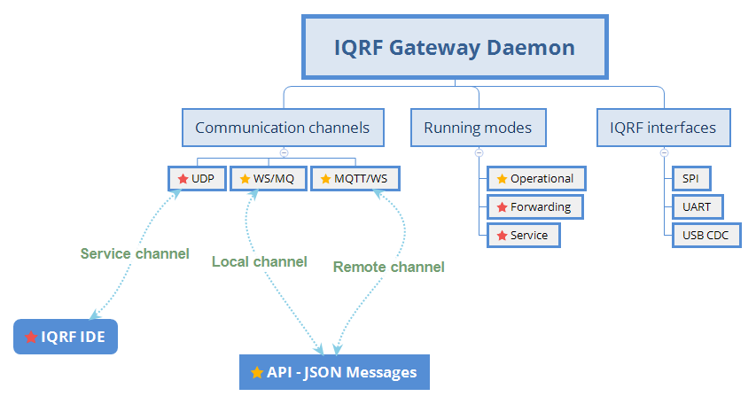
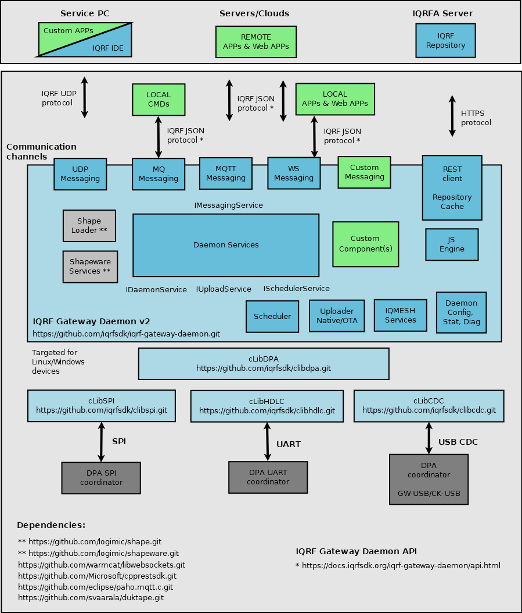

Introduction
============

Open-source components for building IQRF Gateway.

`IQRF Gateway Daemon`_ (IQRF GWD) project provides open-source components for building 
IQRF Gateways. Together they form ready-to-use solution, including an user-friendly 
`Web Interface`_ . Components can be extended or added based on the project requirements. 
All components are licenced under Apache Licence 2.0 and can be used for commercial 
purposes.

    IQRF GWD overview

.. _`IQRF Gateway Daemon`: https://github.com/iqrfsdk/iqrf-gateway-daemon
.. _`Web Interface`: https://github.com/iqrfsdk/iqrf-gateway-webapp

Why v2
------

- Modular design

  - Extendible based on project requirements
  - Based on `Shape framework`_

- `IQRF Standard`_ supported and exposed as JSON API

  - Working with IQRF Repository
  - Offline cached support

- `IQMESH Services`_ introduced and exposed as JSON API

  - Convenient for system integrators
  - Leaving DPA protocol bits and bytes to us

- `IQRF Generic`_ API is kept alive

  - Working with DPA bits and bytes as in GW Daemon v1

- Reworked IQMESH Manager in `IQRF Gateway Webapp`_ 

  - Making use of IQMESH Services as mentioned above

- `WebSocket`_ channel introduced
  
  - Enables Docker containers for End-apps more easily

- IQRF UART interface supported
  
  - Working with `UniPi Neuron IQRF`_ and other boards

- Unicast, broadcast and FRC timing supported 

  - GW Daemon knows correct time to wait for DPA response

- API v1 supported

  - Value of v1 applications

- Growing base of `examples and reference apps`_

  - Great inspiration on how to work with our JSON API from your favourite programming language

- Long term support

  - support@iqrf.org

    IQRF GWD architecture

.. _`Shape framework`: https://github.com/logimic/shape
.. _`IQRF Standards`: https://docs.iqrfsdk.org/iqrf-gateway-daemon/api.html#iqrf-standard
.. _`IQMESH Services`: https://docs.iqrfsdk.org/iqrf-gateway-daemon/api.html#iqmesh-network
.. _`IQRF Generic`: https://docs.iqrfsdk.org/iqrf-gateway-daemon/api.html#iqrf-generic
.. _`IQRF Gateway Webapp`: https://docs.iqrfsdk.org/iqrf-gateway-webapp
.. _`WebSocket`: https://en.wikipedia.org/wiki/WebSocket
.. _`UniPi Neuron IQRF`: https://www.unipi.technology/cs/neuron-s103-iqrf-p139
.. _`examples and reference apps`: https://github.com/iqrfsdk/iqrf-gateway-daemon/tree/master/examples
