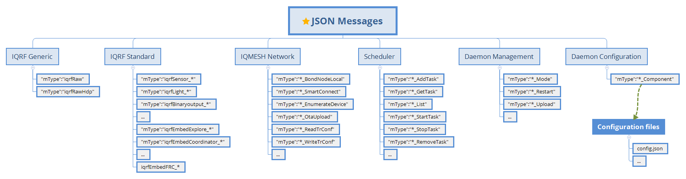

Application Programming Interface
=================================

JSON messages for communication via `MQ`_/`WS`_/`MQTT`_ channels. Messages are compatible from OS v4.02D and 
DPA v3.02 at TR-7xD and higher. It is always highly recommended to use latest OS/DPA FW on the modules. 

IQRF Gateway Daemon API categories:

    IQRF GWD API categories

.. _`MQ`: https://en.wikipedia.org/wiki/Message_queue
.. _`WS`: https://en.wikipedia.org/wiki/WebSocket
.. _`MQTT`: https://cs.wikipedia.org/wiki/MQTT

IQRF Generic
------------

Generic messages are able to handle any DPA packet.

Raw
+++

- `Raw request v1-0-0`_ and `example`__ 
- `Raw response v1-0-0`_ and `example`__

.. _`Raw request v1-0-0`: https://apidocs.iqrf.org/iqrf-gateway-daemon/json/#iqrf/iqrfRaw-request-1-0-0.json
.. __: https://apidocs.iqrf.org/iqrf-gateway-daemon/json/iqrf/examples/iqrfRaw-request-1-0-0-example.json
.. _`Raw response v1-0-0`: https://apidocs.iqrf.org/iqrf-gateway-daemon/json/#iqrf/iqrfRaw-response-1-0-0.json
.. __: https://apidocs.iqrf.org/iqrf-gateway-daemon/json/iqrf/examples/iqrfRaw-response-1-0-0-example.json

RawHdp
++++++

- `RawHdp request v1-0-0`_ and `example`__
- `RawHdp response v1-0-0`_ and and `example`__

.. _`RawHdp request v1-0-0`: https://apidocs.iqrf.org/iqrf-gateway-daemon/json/#iqrf/iqrfRawHdp-request-1-0-0.json
.. __: https://apidocs.iqrf.org/iqrf-gateway-daemon/json/iqrf/examples/iqrfRawHdp-request-1-0-0-example.json
.. _`RawHdp response v1-0-0`: https://apidocs.iqrf.org/iqrf-gateway-daemon/json/#iqrf/iqrfRawHdp-response-1-0-0.json
.. __: https://apidocs.iqrf.org/iqrf-gateway-daemon/json/iqrf/examples/iqrfRawHdp-response-1-0-0-example.json

IQRF Standard
-------------

Standard messages has been design according to `IQRF Standard`_ and `DPA protocol`_.

.. _`IQRF Standard`: https://www.iqrfalliance.org/techDocs
.. _`DPA protocol`: https://www.iqrf.org/DpaTechGuide

Binaryoutput
++++++++++++

- `Enumerate BO request v1-0-0`_ and `example`__
- `Enumerate BO response v1-0-0`_ and `example`__
- `SetOutput request v1-0-0`_ and `example`__
- `SetOutput response v1-0-0`_ and `example`__

.. _`Enumerate BO request v1-0-0`: https://apidocs.iqrf.org/iqrf-gateway-daemon/json/#iqrf/iqrfBinaryoutput_Enumerate-request-1-0-0.json
.. __: https://apidocs.iqrf.org/iqrf-gateway-daemon/json/iqrf/examples/iqrfBinaryoutput_Enumerate-request-1-0-0-example.json
.. _`Enumerate BO response v1-0-0`: https://apidocs.iqrf.org/iqrf-gateway-daemon/json/#iqrf/iqrfBinaryoutput_Enumerate-response-1-0-0.json
.. __: https://apidocs.iqrf.org/iqrf-gateway-daemon/json/iqrf/examples/iqrfBinaryoutput_Enumerate-response-1-0-0-example.json
.. _`SetOutput request v1-0-0`: https://apidocs.iqrf.org/iqrf-gateway-daemon/json/#iqrf/iqrfBinaryoutput_SetOutput-request-1-0-0.json
.. __: https://apidocs.iqrf.org/iqrf-gateway-daemon/json/iqrf/examples/iqrfBinaryoutput_SetOutput-request-1-0-0-example.json
.. _`SetOutput response v1-0-0`: https://apidocs.iqrf.org/iqrf-gateway-daemon/json/#iqrf/iqrfBinaryoutput_SetOutput-response-1-0-0.json
.. __: https://apidocs.iqrf.org/iqrf-gateway-daemon/json/iqrf/examples/iqrfBinaryoutput_SetOutput-response-1-0-0-example.json

Light
+++++

- `Enumerate L request v1-0-0`_ and `example`__
- `Enumerate L response v1-0-0`_ and `example`__
- `SetPower request v1-0-0`_ and `example`__
- `SetPower response v1-0-0`_ and `example`__
- `IncrementPower request v1-0-0`_ and `example`__
- `IncrementPower response v1-0-0`_ and `example`__
- `DecrementPower request v1-0-0`_ and `example`__
- `DecrementPower response v1-0-0`_ and `example`__

.. _`Enumerate L request v1-0-0`: https://apidocs.iqrf.org/iqrf-gateway-daemon/json/#iqrf/iqrfLight_Enumerate-request-1-0-0.json
.. __: https://apidocs.iqrf.org/iqrf-gateway-daemon/json/iqrf/examples/iqrfLight_Enumerate-request-1-0-0-example.json
.. _`Enumerate L response v1-0-0`: https://apidocs.iqrf.org/iqrf-gateway-daemon/json/#iqrf/iqrfLight_Enumerate-response-1-0-0.json
.. __: https://apidocs.iqrf.org/iqrf-gateway-daemon/json/iqrf/examples/iqrfLight_Enumerate-response-1-0-0-example.json
.. _`SetPower request v1-0-0`: https://apidocs.iqrf.org/iqrf-gateway-daemon/json/#iqrf/iqrfLight_SetPower-request-1-0-0.json
.. __: https://apidocs.iqrf.org/iqrf-gateway-daemon/json/iqrf/examples/iqrfLight_SetPower-request-1-0-0-example.json
.. _`SetPower response v1-0-0`: https://apidocs.iqrf.org/iqrf-gateway-daemon/json/#iqrf/iqrfLight_SetPower-response-1-0-0.json
.. __: https://apidocs.iqrf.org/iqrf-gateway-daemon/json/iqrf/examples/iqrfLight_SetPower-response-1-0-0-example.json
.. _`IncrementPower request v1-0-0`: https://apidocs.iqrf.org/iqrf-gateway-daemon/json/#iqrf/iqrfLight_IncrementPower-request-1-0-0.json
.. __: https://apidocs.iqrf.org/iqrf-gateway-daemon/json/iqrf/examples/iqrfLight_IncrementPower-request-1-0-0-example.json
.. _`IncrementPower response v1-0-0`: https://apidocs.iqrf.org/iqrf-gateway-daemon/json/#iqrf/iqrfLight_IncrementPower-response-1-0-0.json
.. __: https://apidocs.iqrf.org/iqrf-gateway-daemon/json/iqrf/examples/iqrfLight_IncrementPower-response-1-0-0-example.json
.. _`DecrementPower request v1-0-0`: https://apidocs.iqrf.org/iqrf-gateway-daemon/json/#iqrf/iqrfLight_DecrementPower-request-1-0-0.json
.. __: https://apidocs.iqrf.org/iqrf-gateway-daemon/json/iqrf/examples/iqrfLight_DecrementPower-request-1-0-0-example.json
.. _`DecrementPower response v1-0-0`: https://apidocs.iqrf.org/iqrf-gateway-daemon/json/#iqrf/iqrfLight_DecrementPower-response-1-0-0.json
.. __: https://apidocs.iqrf.org/iqrf-gateway-daemon/json/iqrf/examples/iqrfLight_DecrementPower-response-1-0-0-example.json

Sensor
++++++

- `Enumerate S request v1-0-0`_ and `example`__
- `Enumerate S response v1-0-0`_ and `example`__
- `ReadSensorsWithTypes request v1-0-0`_ and `example`__
- `ReadSensorsWithTypes response v1-0-0`_ and `example`__
- `Frc request v1-0-0`_ and `example`__
- `Frc response v1-0-0`_ and `example`__

.. _`Enumerate S request v1-0-0`: https://apidocs.iqrf.org/iqrf-gateway-daemon/json/#iqrf/iqrfSensor_Enumerate-request-1-0-0.json
.. __: https://apidocs.iqrf.org/iqrf-gateway-daemon/json/iqrf/examples/iqrfSensor_Enumerate-request-1-0-0-example.json
.. _`Enumerate S response v1-0-0`: https://apidocs.iqrf.org/iqrf-gateway-daemon/json/#iqrf/iqrfSensor_Enumerate-response-1-0-0.json
.. __: https://apidocs.iqrf.org/iqrf-gateway-daemon/json/iqrf/examples/iqrfSensor_Enumerate-response-1-0-0-example.json
.. _`ReadSensorsWithTypes request v1-0-0`: https://apidocs.iqrf.org/iqrf-gateway-daemon/json/#iqrf/iqrfSensor_ReadSensorsWithTypes-request-1-0-0.json
.. __: https://apidocs.iqrf.org/iqrf-gateway-daemon/json/iqrf/examples/iqrfSensor_ReadSensorsWithTypes-request-1-0-0-example.json
.. _`ReadSensorsWithTypes response v1-0-0`: https://apidocs.iqrf.org/iqrf-gateway-daemon/json/#iqrf/iqrfSensor_ReadSensorsWithTypes-response-1-0-0.json
.. __: https://apidocs.iqrf.org/iqrf-gateway-daemon/json/iqrf/examples/iqrfSensor_ReadSensorsWithTypes-response-1-0-0-example.json
.. _`Frc request v1-0-0`: https://apidocs.iqrf.org/iqrf-gateway-daemon/json/#iqrf/iqrfSensor_Frc-request-1-0-0.json
.. __: https://apidocs.iqrf.org/iqrf-gateway-daemon/json/iqrf/examples/iqrfSensor_Frc-request-1-0-0-example.json
.. _`Frc response v1-0-0`: https://apidocs.iqrf.org/iqrf-gateway-daemon/json/#iqrf/iqrfSensor_Frc-response-1-0-0.json
.. __: https://apidocs.iqrf.org/iqrf-gateway-daemon/json/iqrf/examples/iqrfSensor_Frc-response-1-0-0-example.json

Embed Explore
+++++++++++++

- `Enumerate request v1-0-0`_ and `example`__
- `Enumerate response v1-0-0`_ and `example`__
- `PeripheralInformation request v1-0-0`_ and `example`__
- `PeripheralInformation response v1-0-0`_ and `example`__
- `MorePeripheralsInformation request v1-0-0`_ and `example`__
- `MorePeripheralsInformation response v1-0-0`_ and `example`__

.. _`Enumerate request v1-0-0`: https://apidocs.iqrf.org/iqrf-gateway-daemon/json/#iqrf/iqrfEmbedExplore_Enumerate-request-1-0-0.json 
.. __: https://apidocs.iqrf.org/iqrf-gateway-daemon/json/iqrf/examples/iqrfEmbedExplore_Enumerate-request-1-0-0-example.json
.. _`Enumerate response v1-0-0`: https://apidocs.iqrf.org/iqrf-gateway-daemon/json/#iqrf/iqrfEmbedExplore_Enumerate-response-1-0-0.json 
.. __: https://apidocs.iqrf.org/iqrf-gateway-daemon/json/iqrf/examples/iqrfEmbedExplore_Enumerate-response-1-0-0-example.json
.. _`PeripheralInformation request v1-0-0`: https://apidocs.iqrf.org/iqrf-gateway-daemon/json/#iqrf/iqrfEmbedExplore_PeripheralInformation-request-1-0-0.json 
.. __: https://apidocs.iqrf.org/iqrf-gateway-daemon/json/iqrf/examples/iqrfEmbedExplore_PeripheralInformation-request-1-0-0-example.json
.. _`PeripheralInformation response v1-0-0`: https://apidocs.iqrf.org/iqrf-gateway-daemon/json/#iqrf/iqrfEmbedExplore_PeripheralInformation-response-1-0-0.json 
.. __: https://apidocs.iqrf.org/iqrf-gateway-daemon/json/iqrf/examples/iqrfEmbedExplore_PeripheralInformation-response-1-0-0-example.json
.. _`MorePeripheralsInformation request v1-0-0`: https://apidocs.iqrf.org/iqrf-gateway-daemon/json/#iqrf/iqrfEmbedExplore_MorePeripheralsInformation-request-1-0-0.json 
.. __: https://apidocs.iqrf.org/iqrf-gateway-daemon/json/iqrf/examples/iqrfEmbedExplore_MorePeripheralsInformation-request-1-0-0-example.json
.. _`MorePeripheralsInformation response v1-0-0`: https://apidocs.iqrf.org/iqrf-gateway-daemon/json/#iqrf/iqrfEmbedExplore_MorePeripheralsInformation-response-1-0-0.json
.. __: https://apidocs.iqrf.org/iqrf-gateway-daemon/json/iqrf/examples/iqrfEmbedExplore_MorePeripheralsInformation-response-1-0-0-example.json

Embed Coordinator
+++++++++++++++++

- `AddrInfo request v1-0-0`_ and `example`__
- `AddrInfo response v1-0-0`_ and `example`__
- `DiscoveredDevices request v1-0-0`_ and `example`__
- `DiscoveredDevices response v1-0-0`_ and `example`__
- `BondedDevices request v1-0-0`_ and `example`__
- `BondedDevices response v1-0-0`_ and `example`__
- `ClearAllBonds request v1-0-0`_ and `example`__
- `ClearAllBonds response v1-0-0`_ and `example`__
- `BondNode request v1-0-0`_ and `example`__
- `BondNode response v1-0-0`_ and `example`__
- `RemoveBond C request v1-0-0`_ and `example`__
- `RemoveBond C response v1-0-0`_ and `example`__
- `Rebond request v1-0-0`_ and `example`__
- `Rebond response v1-0-0`_ and `example`__
- `Discovery request v1-0-0`_ and `example`__
- `Discovery response v1-0-0`_ and `example`__
- `SetDpaParams request v1-0-0`_ and `example`__
- `SetDpaParams response v1-0-0`_ and `example`__
- `SetHops request v1-0-0`_ and `example`__
- `SetHops response v1-0-0`_ and `example`__
- `DiscoveryData request v1-0-0`_ and `example`__
- `DiscoveryData response v1-0-0`_ and `example`__
- `Backup C request v1-0-0`_ and `example`__
- `Backup C response v1-0-0`_ and `example`__
- `Restore C request v1-0-0`_ and `example`__
- `Restore C response v1-0-0`_ and `example`__
- `AuthorizeBond request v1-0-0`_ and `example`__
- `AuthorizeBond response v1-0-0`_ and `example`__
- `ReadRemotelyBondedMid C request v1-0-0`_ and `example`__
- `ReadRemotelyBondedMid C response v1-0-0`_ and `example`__
- `ClearRemotelyBondedMid C request v1-0-0`_ and `example`__
- `ClearRemotelyBondedMid C response v1-0-0`_ and `example`__
- `EnableRemoteBonding C request v1-0-0`_ and `example`__
- `EnableRemoteBonding C response v1-0-0`_ and `example`__
- `SmartConnect C request v1-0-0`_ and `example`__
- `SmartConnect C response v1-0-0`_ and `example`__
- `SetMID request v1-0-0`_ and `example`__
- `SetMID response v1-0-0`_ and `example`__

.. _`AddrInfo request v1-0-0`: https://apidocs.iqrf.org/iqrf-gateway-daemon/json/#iqrf/iqrfEmbedCoordinator_AddrInfo-request-1-0-0.json
.. __: https://apidocs.iqrf.org/iqrf-gateway-daemon/json/iqrf/examples/iqrfEmbedCoordinator_AddrInfo-request-1-0-0-example.json
.. _`AddrInfo response v1-0-0`: https://apidocs.iqrf.org/iqrf-gateway-daemon/json/#iqrf/iqrfEmbedCoordinator_AddrInfo-response-1-0-0.json
.. __: https://apidocs.iqrf.org/iqrf-gateway-daemon/json/iqrf/examples/iqrfEmbedCoordinator_AddrInfo-response-1-0-0-example.json
.. _`DiscoveredDevices request v1-0-0`: https://apidocs.iqrf.org/iqrf-gateway-daemon/json/#iqrf/iqrfEmbedCoordinator_DiscoveredDevices-request-1-0-0.json
.. __: https://apidocs.iqrf.org/iqrf-gateway-daemon/json/iqrf/examples/iqrfEmbedCoordinator_DiscoveredDevices-request-1-0-0-example.json
.. _`DiscoveredDevices response v1-0-0`: https://apidocs.iqrf.org/iqrf-gateway-daemon/json/#iqrf/iqrfEmbedCoordinator_DiscoveredDevices-response-1-0-0.json
.. __: https://apidocs.iqrf.org/iqrf-gateway-daemon/json/iqrf/examples/iqrfEmbedCoordinator_DiscoveredDevices-response-1-0-0-example.json
.. _`BondedDevices request v1-0-0`: https://apidocs.iqrf.org/iqrf-gateway-daemon/json/#iqrf/iqrfEmbedCoordinator_BondedDevices-request-1-0-0.json
.. __: https://apidocs.iqrf.org/iqrf-gateway-daemon/json/iqrf/examples/iqrfEmbedCoordinator_BondedDevices-request-1-0-0-example.json
.. _`BondedDevices response v1-0-0`: https://apidocs.iqrf.org/iqrf-gateway-daemon/json/#iqrf/iqrfEmbedCoordinator_BondedDevices-response-1-0-0.json
.. __: https://apidocs.iqrf.org/iqrf-gateway-daemon/json/iqrf/examples/iqrfEmbedCoordinator_BondedDevices-response-1-0-0-example.json
.. _`ClearAllBonds request v1-0-0`: https://apidocs.iqrf.org/iqrf-gateway-daemon/json/#iqrf/iqrfEmbedCoordinator_ClearAllBonds-request-1-0-0.json
.. __: https://apidocs.iqrf.org/iqrf-gateway-daemon/json/iqrf/examples/iqrfEmbedCoordinator_ClearAllBonds-request-1-0-0-example.json
.. _`ClearAllBonds response v1-0-0`: https://apidocs.iqrf.org/iqrf-gateway-daemon/json/#iqrf/iqrfEmbedCoordinator_ClearAllBonds-response-1-0-0.json
.. __: https://apidocs.iqrf.org/iqrf-gateway-daemon/json/iqrf/examples/iqrfEmbedCoordinator_ClearAllBonds-response-1-0-0-example.json
.. _`BondNode request v1-0-0`: https://apidocs.iqrf.org/iqrf-gateway-daemon/json/#iqrf/iqrfEmbedCoordinator_BondNode-request-1-0-0.json
.. __: https://apidocs.iqrf.org/iqrf-gateway-daemon/json/iqrf/examples/iqrfEmbedCoordinator_BondNode-request-1-0-0-example.json
.. _`BondNode response v1-0-0`: https://apidocs.iqrf.org/iqrf-gateway-daemon/json/#iqrf/iqrfEmbedCoordinator_BondNode-response-1-0-0.json
.. __: https://apidocs.iqrf.org/iqrf-gateway-daemon/json/iqrf/examples/iqrfEmbedCoordinator_BondNode-response-1-0-0-example.json
.. _`RemoveBond C request v1-0-0`: https://apidocs.iqrf.org/iqrf-gateway-daemon/json/#iqrf/iqrfEmbedCoordinator_RemoveBond-request-1-0-0.json
.. __: https://apidocs.iqrf.org/iqrf-gateway-daemon/json/iqrf/examples/iqrfEmbedCoordinator_RemoveBond-request-1-0-0-example.json
.. _`RemoveBond C response v1-0-0`: https://apidocs.iqrf.org/iqrf-gateway-daemon/json/#iqrf/iqrfEmbedCoordinator_RemoveBond-response-1-0-0.json
.. __: https://apidocs.iqrf.org/iqrf-gateway-daemon/json/iqrf/examples/iqrfEmbedCoordinator_RemoveBond-response-1-0-0-example.json
.. _`Rebond request v1-0-0`: https://apidocs.iqrf.org/iqrf-gateway-daemon/json/#iqrf/iqrfEmbedCoordinator_Rebond-request-1-0-0.json 
.. __: https://apidocs.iqrf.org/iqrf-gateway-daemon/json/iqrf/examples/iqrfEmbedCoordinator_Rebond-request-1-0-0-example.json
.. _`Rebond response v1-0-0`: https://apidocs.iqrf.org/iqrf-gateway-daemon/json/#iqrf/iqrfEmbedCoordinator_Rebond-response-1-0-0.json
.. __: https://apidocs.iqrf.org/iqrf-gateway-daemon/json/iqrf/examples/iqrfEmbedCoordinator_Rebond-response-1-0-0-example.json
.. _`Discovery request v1-0-0`: https://apidocs.iqrf.org/iqrf-gateway-daemon/json/#iqrf/iqrfEmbedCoordinator_Discovery-request-1-0-0.json
.. __: https://apidocs.iqrf.org/iqrf-gateway-daemon/json/iqrf/examples/iqrfEmbedCoordinator_Discovery-request-1-0-0-example.json
.. _`Discovery response v1-0-0`: https://apidocs.iqrf.org/iqrf-gateway-daemon/json/#iqrf/iqrfEmbedCoordinator_Discovery-response-1-0-0.json
.. __: https://apidocs.iqrf.org/iqrf-gateway-daemon/json/iqrf/examples/iqrfEmbedCoordinator_Discovery-response-1-0-0-example.json
.. _`SetDpaParams request v1-0-0`: https://apidocs.iqrf.org/iqrf-gateway-daemon/json/#iqrf/iqrfEmbedCoordinator_SetDpaParams-request-1-0-0.json
.. __: https://apidocs.iqrf.org/iqrf-gateway-daemon/json/iqrf/examples/iqrfEmbedCoordinator_SetDpaParams-request-1-0-0-example.json
.. _`SetDpaParams response v1-0-0`: https://apidocs.iqrf.org/iqrf-gateway-daemon/json/#iqrf/iqrfEmbedCoordinator_SetDpaParams-response-1-0-0.json
.. __: https://apidocs.iqrf.org/iqrf-gateway-daemon/json/iqrf/examples/iqrfEmbedCoordinator_SetDpaParams-response-1-0-0-example.json
.. _`SetHops request v1-0-0`: https://apidocs.iqrf.org/iqrf-gateway-daemon/json/#iqrf/iqrfEmbedCoordinator_SetHops-request-1-0-0.json
.. __: https://apidocs.iqrf.org/iqrf-gateway-daemon/json/iqrf/examples/iqrfEmbedCoordinator_SetHops-request-1-0-0-example.json
.. _`SetHops response v1-0-0`: https://apidocs.iqrf.org/iqrf-gateway-daemon/json/#iqrf/iqrfEmbedCoordinator_SetHops-response-1-0-0.json
.. __: https://apidocs.iqrf.org/iqrf-gateway-daemon/json/iqrf/examples/iqrfEmbedCoordinator_SetHops-response-1-0-0-example.json
.. _`DiscoveryData request v1-0-0`: https://apidocs.iqrf.org/iqrf-gateway-daemon/json/#iqrf/iqrfEmbedCoordinator_DiscoveryData-request-1-0-0.json
.. __: https://apidocs.iqrf.org/iqrf-gateway-daemon/json/iqrf/examples/iqrfEmbedCoordinator_DiscoveryData-request-1-0-0-example.json
.. _`DiscoveryData response v1-0-0`: https://apidocs.iqrf.org/iqrf-gateway-daemon/json/#iqrf/iqrfEmbedCoordinator_DiscoveryData-response-1-0-0.json
.. __: https://apidocs.iqrf.org/iqrf-gateway-daemon/json/iqrf/examples/iqrfEmbedCoordinator_DiscoveryData-response-1-0-0-example.json
.. _`Backup C request v1-0-0`: https://apidocs.iqrf.org/iqrf-gateway-daemon/json/#iqrf/iqrfEmbedCoordinator_Backup-request-1-0-0.json
.. __: https://apidocs.iqrf.org/iqrf-gateway-daemon/json/iqrf/examples/iqrfEmbedCoordinator_Backup-request-1-0-0-example.json
.. _`Backup C response v1-0-0`: https://apidocs.iqrf.org/iqrf-gateway-daemon/json/#iqrf/iqrfEmbedCoordinator_Backup-response-1-0-0.json
.. __: https://apidocs.iqrf.org/iqrf-gateway-daemon/json/iqrf/examples/iqrfEmbedCoordinator_Backup-response-1-0-0-example.json
.. _`Restore C request v1-0-0`: https://apidocs.iqrf.org/iqrf-gateway-daemon/json/#iqrf/iqrfEmbedCoordinator_Restore-request-1-0-0.json
.. __: https://apidocs.iqrf.org/iqrf-gateway-daemon/json/iqrf/examples/iqrfEmbedCoordinator_Restore-request-1-0-0-example.json
.. _`Restore C response v1-0-0`: https://apidocs.iqrf.org/iqrf-gateway-daemon/json/#iqrf/iqrfEmbedCoordinator_Restore-response-1-0-0.json
.. __: https://apidocs.iqrf.org/iqrf-gateway-daemon/json/iqrf/examples/iqrfEmbedCoordinator_Restore-response-1-0-0-example.json
.. _`AuthorizeBond request v1-0-0`: https://apidocs.iqrf.org/iqrf-gateway-daemon/json/#iqrf/iqrfEmbedCoordinator_AuthorizeBond-request-1-0-0.json
.. __: https://apidocs.iqrf.org/iqrf-gateway-daemon/json/iqrf/examples/iqrfEmbedCoordinator_AuthorizeBond-request-1-0-0-example.json
.. _`AuthorizeBond response v1-0-0`: https://apidocs.iqrf.org/iqrf-gateway-daemon/json/#iqrf/iqrfEmbedCoordinator_AuthorizeBond-response-1-0-0.json
.. __: https://apidocs.iqrf.org/iqrf-gateway-daemon/json/iqrf/examples/iqrfEmbedCoordinator_AuthorizeBond-response-1-0-0-example.json
.. _`ReadRemotelyBondedMid C request v1-0-0`: https://apidocs.iqrf.org/iqrf-gateway-daemon/json/#iqrf/iqrfEmbedCoordinator_ReadRemotelyBondedMid-request-1-0-0.json
.. __: https://apidocs.iqrf.org/iqrf-gateway-daemon/json/iqrf/examples/iqrfEmbedCoordinator_ReadRemotelyBondedMid-request-1-0-0-example.json
.. _`ReadRemotelyBondedMid C response v1-0-0`: https://apidocs.iqrf.org/iqrf-gateway-daemon/json/#iqrf/iqrfEmbedCoordinator_ReadRemotelyBondedMid-response-1-0-0.json
.. __: https://apidocs.iqrf.org/iqrf-gateway-daemon/json/iqrf/examples/iqrfEmbedCoordinator_ReadRemotelyBondedMid-response-1-0-0-example.json
.. _`ClearRemotelyBondedMid C request v1-0-0`: https://apidocs.iqrf.org/iqrf-gateway-daemon/json/#iqrf/iqrfEmbedCoordinator_ClearRemotelyBondedMid-request-1-0-0.json
.. __: https://apidocs.iqrf.org/iqrf-gateway-daemon/json/iqrf/examples/iqrfEmbedCoordinator_ClearRemotelyBondedMid-request-1-0-0-example.json
.. _`ClearRemotelyBondedMid C response v1-0-0`: https://apidocs.iqrf.org/iqrf-gateway-daemon/json/#iqrf/iqrfEmbedCoordinator_ClearRemotelyBondedMid-response-1-0-0.json
.. __: https://apidocs.iqrf.org/iqrf-gateway-daemon/json/iqrf/examples/iqrfEmbedCoordinator_ClearRemotelyBondedMid-response-1-0-0-example.json
.. _`EnableRemoteBonding C request v1-0-0`: https://apidocs.iqrf.org/iqrf-gateway-daemon/json/#iqrf/iqrfEmbedCoordinator_EnableRemoteBonding-request-1-0-0.json
.. __: https://apidocs.iqrf.org/iqrf-gateway-daemon/json/iqrf/examples/iqrfEmbedCoordinator_EnableRemoteBonding-request-1-0-0-example.json
.. _`EnableRemoteBonding C response v1-0-0`: https://apidocs.iqrf.org/iqrf-gateway-daemon/json/#iqrf/iqrfEmbedCoordinator_EnableRemoteBonding-response-1-0-0.json
.. __: https://apidocs.iqrf.org/iqrf-gateway-daemon/json/iqrf/examples/iqrfEmbedCoordinator_EnableRemoteBonding-response-1-0-0-example.json
.. _`SmartConnect C request v1-0-0`: https://apidocs.iqrf.org/iqrf-gateway-daemon/json/#iqrf/iqrfEmbedCoordinator_SmartConnect-request-1-0-0.json
.. __: https://apidocs.iqrf.org/iqrf-gateway-daemon/json/iqrf/examples/iqrfEmbedCoordinator_SmartConnect-request-1-0-0-example.json
.. _`SmartConnect C response v1-0-0`: https://apidocs.iqrf.org/iqrf-gateway-daemon/json/#iqrf/iqrfEmbedCoordinator_SmartConnect-response-1-0-0.json
.. __: https://apidocs.iqrf.org/iqrf-gateway-daemon/json/iqrf/examples/iqrfEmbedCoordinator_SmartConnect-response-1-0-0-example.json
.. _`SetMID request v1-0-0`: https://apidocs.iqrf.org/iqrf-gateway-daemon/json/#iqrf/iqrfEmbedCoordinator_SetMID-request-1-0-0.json
.. __: https://apidocs.iqrf.org/iqrf-gateway-daemon/json/iqrf/examples/iqrfEmbedCoordinator_SetMID-request-1-0-0-example.json
.. _`SetMID response v1-0-0`: https://apidocs.iqrf.org/iqrf-gateway-daemon/json/#iqrf/iqrfEmbedCoordinator_SetMID-response-1-0-0.json
.. __: https://apidocs.iqrf.org/iqrf-gateway-daemon/json/iqrf/examples/iqrfEmbedCoordinator_SetMID-response-1-0-0-example.json

Embed Node
++++++++++

- `Read N request v1-0-0`_ and `example`__
- `Read N response v1-0-0`_ and `example`__
- `RemoveBond N request v1-0-0`_ and `example`__
- `RemoveBond N response v1-0-0`_ and `example`__
- `Backup N request v1-0-0`_ and `example`__
- `Backup N response v1-0-0`_ and `example`__
- `Restore N request v1-0-0`_ and `example`__
- `Restore N response v1-0-0`_ and `example`__
- `ReadRemotelyBondedMid N request v1-0-0`_ and `example`__
- `ReadRemotelyBondedMid N response v1-0-0`_ and `example`__
- `ClearRemotelyBondedMid N request v1-0-0`_ and `example`__
- `ClearRemotelyBondedMid N response v1-0-0`_ and `example`__
- `EnableRemoteBonding N request v1-0-0`_ and `example`__
- `EnableRemoteBonding N response v1-0-0`_ and `example`__
- `ValidateBonds request v1-0-0`_ and `example`__
- `ValidateBonds response v1-0-0`_ and `example`__

.. _`Read N request v1-0-0`: https://apidocs.iqrf.org/iqrf-gateway-daemon/json/#iqrf/iqrfEmbedNode_Read-request-1-0-0.json
.. __: https://apidocs.iqrf.org/iqrf-gateway-daemon/json/iqrf/examples/iqrfEmbedNode_Read-request-1-0-0-example.json
.. _`Read N response v1-0-0`: https://apidocs.iqrf.org/iqrf-gateway-daemon/json/#iqrf/iqrfEmbedNode_Read-response-1-0-0.json
.. __: https://apidocs.iqrf.org/iqrf-gateway-daemon/json/iqrf/examples/iqrfEmbedNode_Read-response-1-0-0-example.json
.. _`RemoveBond N request v1-0-0`: https://apidocs.iqrf.org/iqrf-gateway-daemon/json/#iqrf/iqrfEmbedNode_RemoveBond-request-1-0-0.json
.. __: https://apidocs.iqrf.org/iqrf-gateway-daemon/json/iqrf/examples/iqrfEmbedNode_RemoveBond-request-1-0-0-example.json
.. _`RemoveBond N response v1-0-0`: https://apidocs.iqrf.org/iqrf-gateway-daemon/json/#iqrf/iqrfEmbedNode_RemoveBond-response-1-0-0.json
.. __: https://apidocs.iqrf.org/iqrf-gateway-daemon/json/iqrf/examples/iqrfEmbedNode_RemoveBond-response-1-0-0-example.json
.. _`Backup N request v1-0-0`: https://apidocs.iqrf.org/iqrf-gateway-daemon/json/#iqrf/iqrfEmbedNode_Backup-request-1-0-0.json
.. __: https://apidocs.iqrf.org/iqrf-gateway-daemon/json/iqrf/examples/iqrfEmbedNode_Backup-request-1-0-0-example.json
.. _`Backup N response v1-0-0`: https://apidocs.iqrf.org/iqrf-gateway-daemon/json/#iqrf/iqrfEmbedNode_Backup-response-1-0-0.json
.. __: https://apidocs.iqrf.org/iqrf-gateway-daemon/json/iqrf/examples/iqrfEmbedNode_Backup-response-1-0-0-example.json
.. _`Restore N request v1-0-0`: https://apidocs.iqrf.org/iqrf-gateway-daemon/json/#iqrf/iqrfEmbedNode_Restore-request-1-0-0.json
.. __: https://apidocs.iqrf.org/iqrf-gateway-daemon/json/iqrf/examples/iqrfEmbedNode_Restore-request-1-0-0-example.json
.. _`Restore N response v1-0-0`: https://apidocs.iqrf.org/iqrf-gateway-daemon/json/#iqrf/iqrfEmbedNode_Restore-response-1-0-0.json
.. __: https://apidocs.iqrf.org/iqrf-gateway-daemon/json/iqrf/examples/iqrfEmbedNode_Restore-response-1-0-0-example.json
.. _`ReadRemotelyBondedMid N request v1-0-0`: https://apidocs.iqrf.org/iqrf-gateway-daemon/json/#iqrf/iqrfEmbedNode_ReadRemotelyBondedMid-request-1-0-0.json
.. __: https://apidocs.iqrf.org/iqrf-gateway-daemon/json/iqrf/examples/iqrfEmbedNode_ReadRemotelyBondedMid-request-1-0-0-example.json
.. _`ReadRemotelyBondedMid N response v1-0-0`: https://apidocs.iqrf.org/iqrf-gateway-daemon/json/#iqrf/iqrfEmbedNode_ReadRemotelyBondedMid-response-1-0-0.json
.. __: https://apidocs.iqrf.org/iqrf-gateway-daemon/json/iqrf/examples/iqrfEmbedNode_ReadRemotelyBondedMid-response-1-0-0-example.json
.. _`ClearRemotelyBondedMid N request v1-0-0`: https://apidocs.iqrf.org/iqrf-gateway-daemon/json/#iqrf/iqrfEmbedNode_ClearRemotelyBondedMid-request-1-0-0.json
.. __: https://apidocs.iqrf.org/iqrf-gateway-daemon/json/iqrf/examples/iqrfEmbedNode_ClearRemotelyBondedMid-request-1-0-0-example.json
.. _`ClearRemotelyBondedMid N response v1-0-0`: https://apidocs.iqrf.org/iqrf-gateway-daemon/json/#iqrf/iqrfEmbedNode_ClearRemotelyBondedMid-response-1-0-0.json
.. __: https://apidocs.iqrf.org/iqrf-gateway-daemon/json/iqrf/examples/iqrfEmbedNode_ClearRemotelyBondedMid-response-1-0-0-example.json
.. _`EnableRemoteBonding N request v1-0-0`: https://apidocs.iqrf.org/iqrf-gateway-daemon/json/#iqrf/iqrfEmbedNode_EnableRemoteBonding-request-1-0-0.json
.. __: https://apidocs.iqrf.org/iqrf-gateway-daemon/json/iqrf/examples/iqrfEmbedNode_EnableRemoteBonding-request-1-0-0-example.json
.. _`EnableRemoteBonding N response v1-0-0`: https://apidocs.iqrf.org/iqrf-gateway-daemon/json/#iqrf/iqrfEmbedNode_EnableRemoteBonding-response-1-0-0.json
.. __: https://apidocs.iqrf.org/iqrf-gateway-daemon/json/iqrf/examples/iqrfEmbedNode_EnableRemoteBonding-response-1-0-0-example.json
.. _`ValidateBonds request v1-0-0`: https://apidocs.iqrf.org/iqrf-gateway-daemon/json/#iqrf/iqrfEmbedNode_ValidateBonds-request-1-0-0.json
.. __: https://apidocs.iqrf.org/iqrf-gateway-daemon/json/iqrf/examples/iqrfEmbedNode_ValidateBonds-request-1-0-0-example.json
.. _`ValidateBonds response v1-0-0`: https://apidocs.iqrf.org/iqrf-gateway-daemon/json/#iqrf/iqrfEmbedNode_ValidateBonds-response-1-0-0.json
.. __: https://apidocs.iqrf.org/iqrf-gateway-daemon/json/iqrf/examples/iqrfEmbedNode_ValidateBonds-response-1-0-0-example.json

Embed OS
++++++++

- `Read OS request v1-0-0`_ and `example`__
- `Read OS response v1-0-0`_ and `example`__
- `Batch request v1-0-0`_ and `example`__
- `Batch response v1-0-0`_ and `example`__
- `SelectiveBatch request v1-0-0`_ and `example`__
- `SelectiveBatch response v1-0-0`_ and `example`__
- `Reset request v1-0-0`_ and `example`__
- `Reset response v1-0-0`_ and `example`__
- `Restart request v1-0-0`_ and `example`__
- `Restart response v1-0-0`_ and `example`__
- `RunRfpgm request v1-0-0`_ and `example`__
- `RunRfpgm response v1-0-0`_ and `example`__
- `SetSecurity request v1-0-0`_ and `example`__
- `SetSecurity response v1-0-0`_ and `example`__
- `Sleep request v1-0-0`_ and `example`__
- `Sleep response v1-0-0`_ and `example`__
- `LoadCode request v1-0-0`_ and `example`__
- `LoadCode response v1-0-0`_ and `example`__
- `ReadCfg request v1-0-0`_ and `example`__
- `ReadCfg response v1-0-0`_ and `example`__
- `WriteCfg request v1-0-0`_ and `example`__
- `WriteCfg response v1-0-0`_ and `example`__
- `WriteCfgByte request v1-0-0`_ and `example`__
- `WriteCfgByte response v1-0-0`_ and `example`__

.. _`Read OS request v1-0-0`: https://apidocs.iqrf.org/iqrf-gateway-daemon/json/#iqrf/iqrfEmbedOs_Read-request-1-0-0.json
.. __: https://apidocs.iqrf.org/iqrf-gateway-daemon/json/iqrf/examples/iqrfEmbedOs_Read-request-1-0-0-example.json
.. _`Read OS response v1-0-0`: https://apidocs.iqrf.org/iqrf-gateway-daemon/json/#iqrf/iqrfEmbedOs_Read-response-1-0-0.json
.. __: https://apidocs.iqrf.org/iqrf-gateway-daemon/json/iqrf/examples/iqrfEmbedOs_Read-response-1-0-0-example.json
.. _`Batch request v1-0-0`: https://apidocs.iqrf.org/iqrf-gateway-daemon/json/#iqrf/iqrfEmbedOs_Batch-request-1-0-0.json
.. __: https://apidocs.iqrf.org/iqrf-gateway-daemon/json/iqrf/examples/iqrfEmbedOs_Batch-request-1-0-0-example.json
.. _`Batch response v1-0-0`: https://apidocs.iqrf.org/iqrf-gateway-daemon/json/#iqrf/iqrfEmbedOs_Batch-response-1-0-0.json
.. __: https://apidocs.iqrf.org/iqrf-gateway-daemon/json/iqrf/examples/iqrfEmbedOs_Batch-response-1-0-0-example.json
.. _`SelectiveBatch request v1-0-0`: https://apidocs.iqrf.org/iqrf-gateway-daemon/json/#iqrf/iqrfEmbedOs_SelectiveBatch-request-1-0-0.json
.. __: https://apidocs.iqrf.org/iqrf-gateway-daemon/json/iqrf/examples/iqrfEmbedOs_SelectiveBatch-request-1-0-0-example.json
.. _`SelectiveBatch response v1-0-0`: https://apidocs.iqrf.org/iqrf-gateway-daemon/json/#iqrf/iqrfEmbedOs_SelectiveBatch-response-1-0-0.json
.. __: https://apidocs.iqrf.org/iqrf-gateway-daemon/json/iqrf/examples/iqrfEmbedOs_SelectiveBatch-response-1-0-0-example.json
.. _`Reset request v1-0-0`: https://apidocs.iqrf.org/iqrf-gateway-daemon/json/#iqrf/iqrfEmbedOs_Reset-request-1-0-0.json
.. __: https://apidocs.iqrf.org/iqrf-gateway-daemon/json/iqrf/examples/iqrfEmbedOs_Reset-request-1-0-0-example.json
.. _`Reset response v1-0-0`: https://apidocs.iqrf.org/iqrf-gateway-daemon/json/#iqrf/iqrfEmbedOs_Reset-response-1-0-0.json
.. __: https://apidocs.iqrf.org/iqrf-gateway-daemon/json/iqrf/examples/iqrfEmbedOs_Reset-response-1-0-0-example.json
.. _`Restart request v1-0-0`: https://apidocs.iqrf.org/iqrf-gateway-daemon/json/#iqrf/iqrfEmbedOs_Restart-request-1-0-0.json
.. __: https://apidocs.iqrf.org/iqrf-gateway-daemon/json/iqrf/examples/iqrfEmbedOs_Restart-request-1-0-0-example.json
.. _`Restart response v1-0-0`: https://apidocs.iqrf.org/iqrf-gateway-daemon/json/#iqrf/iqrfEmbedOs_Restart-response-1-0-0.json
.. __: https://apidocs.iqrf.org/iqrf-gateway-daemon/json/iqrf/examples/iqrfEmbedOs_Restart-response-1-0-0-example.json
.. _`RunRfpgm request v1-0-0`: https://apidocs.iqrf.org/iqrf-gateway-daemon/json/#iqrf/iqrfEmbedOs_RunRfpgm-request-1-0-0.json
.. __: https://apidocs.iqrf.org/iqrf-gateway-daemon/json/iqrf/examples/iqrfEmbedOs_RunRfpgm-request-1-0-0-example.json
.. _`RunRfpgm response v1-0-0`: https://apidocs.iqrf.org/iqrf-gateway-daemon/json/#iqrf/iqrfEmbedOs_RunRfpgm-response-1-0-0.json
.. __: https://apidocs.iqrf.org/iqrf-gateway-daemon/json/iqrf/examples/iqrfEmbedOs_RunRfpgm-response-1-0-0-example.json
.. _`SetSecurity request v1-0-0`: https://apidocs.iqrf.org/iqrf-gateway-daemon/json/#iqrf/iqrfEmbedOs_SetSecurity-request-1-0-0.json
.. __: https://apidocs.iqrf.org/iqrf-gateway-daemon/json/iqrf/examples/iqrfEmbedOs_SetSecurity-request-1-0-0-example.json
.. _`SetSecurity response v1-0-0`: https://apidocs.iqrf.org/iqrf-gateway-daemon/json/#iqrf/iqrfEmbedOs_SetSecurity-response-1-0-0.json
.. __: https://apidocs.iqrf.org/iqrf-gateway-daemon/json/iqrf/examples/iqrfEmbedOs_SetSecurity-response-1-0-0-example.json
.. _`Sleep request v1-0-0`: https://apidocs.iqrf.org/iqrf-gateway-daemon/json/#iqrf/iqrfEmbedOs_Sleep-request-1-0-0.json
.. __: https://apidocs.iqrf.org/iqrf-gateway-daemon/json/iqrf/examples/iqrfEmbedOs_Sleep-request-1-0-0-example.json
.. _`Sleep response v1-0-0`: https://apidocs.iqrf.org/iqrf-gateway-daemon/json/#iqrf/iqrfEmbedOs_Sleep-response-1-0-0.json
.. __: https://apidocs.iqrf.org/iqrf-gateway-daemon/json/iqrf/examples/iqrfEmbedOs_Sleep-response-1-0-0-example.json
.. _`LoadCode request v1-0-0`: https://apidocs.iqrf.org/iqrf-gateway-daemon/json/#iqrf/iqrfEmbedOs_LoadCode-request-1-0-0.json
.. __: https://apidocs.iqrf.org/iqrf-gateway-daemon/json/iqrf/examples/iqrfEmbedOs_LoadCode-request-1-0-0-example.json
.. _`LoadCode response v1-0-0`: https://apidocs.iqrf.org/iqrf-gateway-daemon/json/#iqrf/iqrfEmbedOs_LoadCode-response-1-0-0.json
.. __: https://apidocs.iqrf.org/iqrf-gateway-daemon/json/iqrf/examples/iqrfEmbedOs_LoadCode-response-1-0-0-example.json
.. _`ReadCfg request v1-0-0`: https://apidocs.iqrf.org/iqrf-gateway-daemon/json/#iqrf/iqrfEmbedOs_ReadCfg-request-1-0-0.json
.. __: https://apidocs.iqrf.org/iqrf-gateway-daemon/json/iqrf/examples/iqrfEmbedOs_ReadCfg-request-1-0-0-example.json
.. _`ReadCfg response v1-0-0`: https://apidocs.iqrf.org/iqrf-gateway-daemon/json/#iqrf/iqrfEmbedOs_ReadCfg-response-1-0-0.json
.. __: https://apidocs.iqrf.org/iqrf-gateway-daemon/json/iqrf/examples/iqrfEmbedOs_ReadCfg-response-1-0-0-example.json
.. _`WriteCfg request v1-0-0`: https://apidocs.iqrf.org/iqrf-gateway-daemon/json/#iqrf/iqrfEmbedOs_WriteCfg-request-1-0-0.json
.. __: https://apidocs.iqrf.org/iqrf-gateway-daemon/json/iqrf/examples/iqrfEmbedOs_WriteCfg-request-1-0-0-example.json
.. _`WriteCfg response v1-0-0`: https://apidocs.iqrf.org/iqrf-gateway-daemon/json/#iqrf/iqrfEmbedOs_WriteCfg-response-1-0-0.json
.. __: https://apidocs.iqrf.org/iqrf-gateway-daemon/json/iqrf/examples/iqrfEmbedOs_WriteCfg-response-1-0-0-example.json
.. _`WriteCfgByte request v1-0-0`: https://apidocs.iqrf.org/iqrf-gateway-daemon/json/#iqrf/iqrfEmbedOs_WriteCfgByte-request-1-0-0.json
.. __: https://apidocs.iqrf.org/iqrf-gateway-daemon/json/iqrf/examples/iqrfEmbedOs_WriteCfgByte-request-1-0-0-example.json
.. _`WriteCfgByte response v1-0-0`: https://apidocs.iqrf.org/iqrf-gateway-daemon/json/#iqrf/iqrfEmbedOs_WriteCfgByte-response-1-0-0.json
.. __: https://apidocs.iqrf.org/iqrf-gateway-daemon/json/iqrf/examples/iqrfEmbedOs_WriteCfgByte-response-1-0-0-example.json

Embed EEPROM
++++++++++++

- `Read EE request v1-0-0`_ and `example`__
- `Read EE response v1-0-0`_ and `example`__
- `Write EE request v1-0-0`_ and `example`__
- `Write EE response v1-0-0`_ and `example`__

.. _`Read EE request v1-0-0`: https://apidocs.iqrf.org/iqrf-gateway-daemon/json/#iqrf/iqrfEmbedEeprom_Read-request-1-0-0.json
.. __: https://apidocs.iqrf.org/iqrf-gateway-daemon/json/iqrf/examples/iqrfEmbedEeprom_Read-request-1-0-0-example.json
.. _`Read EE response v1-0-0`: https://apidocs.iqrf.org/iqrf-gateway-daemon/json/#iqrf/iqrfEmbedEeprom_Read-response-1-0-0.json
.. __: https://apidocs.iqrf.org/iqrf-gateway-daemon/json/iqrf/examples/iqrfEmbedEeprom_Read-response-1-0-0-example.json
.. _`Write EE request v1-0-0`: https://apidocs.iqrf.org/iqrf-gateway-daemon/json/#iqrf/iqrfEmbedEeprom_Write-request-1-0-0.json
.. __: https://apidocs.iqrf.org/iqrf-gateway-daemon/json/iqrf/examples/iqrfEmbedEeprom_Write-request-1-0-0-example.json
.. _`Write EE response v1-0-0`: https://apidocs.iqrf.org/iqrf-gateway-daemon/json/#iqrf/iqrfEmbedEeprom_Write-response-1-0-0.json
.. __: https://apidocs.iqrf.org/iqrf-gateway-daemon/json/iqrf/examples/iqrfEmbedEeprom_Write-response-1-0-0-example.json

Embed EEEPROM
+++++++++++++

- `Read EEE request v1-0-0`_ and `example`__
- `Read EEE response v1-0-0`_ and `example`__
- `Write EEE request v1-0-0`_ and `example`__
- `Write EEE response v1-0-0`_ and `example`__

.. _`Read EEE request v1-0-0`: https://apidocs.iqrf.org/iqrf-gateway-daemon/json/#iqrf/iqrfEmbedEeeprom_Read-request-1-0-0.json
.. __: https://apidocs.iqrf.org/iqrf-gateway-daemon/json/iqrf/examples/iqrfEmbedEeeprom_Read-request-1-0-0-example.json
.. _`Read EEE response v1-0-0`: https://apidocs.iqrf.org/iqrf-gateway-daemon/json/#iqrf/iqrfEmbedEeeprom_Read-response-1-0-0.json
.. __: https://apidocs.iqrf.org/iqrf-gateway-daemon/json/iqrf/examples/iqrfEmbedEeeprom_Read-response-1-0-0-example.json
.. _`Write EEE request v1-0-0`: https://apidocs.iqrf.org/iqrf-gateway-daemon/json/#iqrf/iqrfEmbedEeeprom_Write-request-1-0-0.json
.. __: https://apidocs.iqrf.org/iqrf-gateway-daemon/json/iqrf/examples/iqrfEmbedEeeprom_Write-request-1-0-0-example.json
.. _`Write EEE response v1-0-0`: https://apidocs.iqrf.org/iqrf-gateway-daemon/json/#iqrf/iqrfEmbedEeeprom_Write-response-1-0-0.json
.. __: https://apidocs.iqrf.org/iqrf-gateway-daemon/json/iqrf/examples/iqrfEmbedEeeprom_Write-response-1-0-0-example.json

Embed RAM
+++++++++

- `Read RAM request v1-0-0`_ and `example`__
- `Read RAM response v1-0-0`_ and `example`__
- `Write RAM request v1-0-0`_ and `example`__
- `Write RAM response v1-0-0`_ and `example`__

.. _`Read RAM request v1-0-0`: https://apidocs.iqrf.org/iqrf-gateway-daemon/json/#iqrf/iqrfEmbedRam_Read-request-1-0-0.json
.. __: https://apidocs.iqrf.org/iqrf-gateway-daemon/json/iqrf/examples/iqrfEmbedRam_Read-request-1-0-0-example.json
.. _`Read RAM response v1-0-0`: https://apidocs.iqrf.org/iqrf-gateway-daemon/json/#iqrf/iqrfEmbedRam_Read-response-1-0-0.json
.. __: https://apidocs.iqrf.org/iqrf-gateway-daemon/json/iqrf/examples/iqrfEmbedRam_Read-response-1-0-0-example.json
.. _`Write RAM request v1-0-0`: https://apidocs.iqrf.org/iqrf-gateway-daemon/json/#iqrf/iqrfEmbedRam_Write-request-1-0-0.json
.. __: https://apidocs.iqrf.org/iqrf-gateway-daemon/json/iqrf/examples/iqrfEmbedRam_Write-request-1-0-0-example.json
.. _`Write RAM response v1-0-0`: https://apidocs.iqrf.org/iqrf-gateway-daemon/json/#iqrf/iqrfEmbedRam_Write-response-1-0-0.json
.. __: https://apidocs.iqrf.org/iqrf-gateway-daemon/json/iqrf/examples/iqrfEmbedRam_Write-response-1-0-0-example.json

Embed SPI
+++++++++

- `WriteRead SPI request v1-0-0`_ and `example`__
- `WriteRead SPI response v1-0-0`_ and `example`__

.. _`WriteRead SPI request v1-0-0`: https://apidocs.iqrf.org/iqrf-gateway-daemon/json/#iqrf/iqrfEmbedSpi_WriteRead-request-1-0-0.json
.. __: https://apidocs.iqrf.org/iqrf-gateway-daemon/json/iqrf/examples/iqrfEmbedSpi_WriteRead-request-1-0-0-example.json
.. _`WriteRead SPI response v1-0-0`: https://apidocs.iqrf.org/iqrf-gateway-daemon/json/#iqrf/iqrfEmbedSpi_WriteRead-response-1-0-0.json
.. __: https://apidocs.iqrf.org/iqrf-gateway-daemon/json/iqrf/examples/iqrfEmbedSpi_WriteRead-response-1-0-0-example.json

Embed LEDR
++++++++++

- `Set LEDR request v1-0-0`_ and `example`__
- `Set LEDR response v1-0-0`_ and `example`__
- `Get LEDR request v1-0-0`_ and `example`__
- `Get LEDR response v1-0-0`_ and `example`__
- `Pulse LEDR request v1-0-0`_ and `example`__
- `Pulse LEDR response v1-0-0`_ and `example`__
- `Flashing LEDR request v1-0-0`_ and `example`__
- `Flashing LEDR response v1-0-0`_ and `example`__

.. _`Set LEDR request v1-0-0`: https://apidocs.iqrf.org/iqrf-gateway-daemon/json/#iqrf/iqrfEmbedLedr_Set-request-1-0-0.json
.. __: https://apidocs.iqrf.org/iqrf-gateway-daemon/json/iqrf/examples/iqrfEmbedLedr_Set-request-1-0-0-example.json
.. _`Set LEDR response v1-0-0`: https://apidocs.iqrf.org/iqrf-gateway-daemon/json/#iqrf/iqrfEmbedLedr_Set-response-1-0-0.json
.. __: https://apidocs.iqrf.org/iqrf-gateway-daemon/json/iqrf/examples/iqrfEmbedLedr_Set-response-1-0-0-example.json
.. _`Get LEDR request v1-0-0`: https://apidocs.iqrf.org/iqrf-gateway-daemon/json/#iqrf/iqrfEmbedLedr_Get-request-1-0-0.json
.. __: https://apidocs.iqrf.org/iqrf-gateway-daemon/json/iqrf/examples/iqrfEmbedLedr_Get-request-1-0-0-example.json
.. _`Get LEDR response v1-0-0`: https://apidocs.iqrf.org/iqrf-gateway-daemon/json/#iqrf/iqrfEmbedLedr_Get-response-1-0-0.json
.. __: https://apidocs.iqrf.org/iqrf-gateway-daemon/json/iqrf/examples/iqrfEmbedLedr_Get-response-1-0-0-example.json
.. _`Pulse LEDR request v1-0-0`: https://apidocs.iqrf.org/iqrf-gateway-daemon/json/#iqrf/iqrfEmbedLedr_Pulse-request-1-0-0.json
.. __: https://apidocs.iqrf.org/iqrf-gateway-daemon/json/iqrf/examples/iqrfEmbedLedr_Pulse-request-1-0-0-example.json
.. _`Pulse LEDR response v1-0-0`: https://apidocs.iqrf.org/iqrf-gateway-daemon/json/#iqrf/iqrfEmbedLedr_Pulse-response-1-0-0.json
.. __: https://apidocs.iqrf.org/iqrf-gateway-daemon/json/iqrf/examples/iqrfEmbedLedr_Pulse-response-1-0-0-example.json
.. _`Flashing LEDR request v1-0-0`: https://apidocs.iqrf.org/iqrf-gateway-daemon/json/#iqrf/iqrfEmbedLedr_Flashing-request-1-0-0.json
.. __: https://apidocs.iqrf.org/iqrf-gateway-daemon/json/iqrf/examples/iqrfEmbedLedr_Flashing-request-1-0-0-example.json
.. _`Flashing LEDR response v1-0-0`: https://apidocs.iqrf.org/iqrf-gateway-daemon/json/#iqrf/iqrfEmbedLedr_Flashing-response-1-0-0.json
.. __: https://apidocs.iqrf.org/iqrf-gateway-daemon/json/iqrf/examples/iqrfEmbedLedr_Flashing-response-1-0-0-example.json

Embed LEDG
++++++++++

- `Set LEDG request v1-0-0`_ and `example`__
- `Set LEDG response v1-0-0`_ and `example`__
- `Get LEDG request v1-0-0`_ and `example`__
- `Get LEDG response v1-0-0`_ and `example`__
- `Pulse LEDG request v1-0-0`_ and `example`__
- `Pulse LEDG response v1-0-0`_ and `example`__
- `Flashing LEDG request v1-0-0`_ and `example`__
- `Flashing LEDG response v1-0-0`_ and `example`__

.. _`Set LEDG request v1-0-0`: https://apidocs.iqrf.org/iqrf-gateway-daemon/json/#iqrf/iqrfEmbedLedg_Set-request-1-0-0.json
.. __: https://apidocs.iqrf.org/iqrf-gateway-daemon/json/iqrf/examples/iqrfEmbedLedg_Set-request-1-0-0-example.json
.. _`Set LEDG response v1-0-0`: https://apidocs.iqrf.org/iqrf-gateway-daemon/json/#iqrf/iqrfEmbedLedg_Set-response-1-0-0.json
.. __: https://apidocs.iqrf.org/iqrf-gateway-daemon/json/iqrf/examples/iqrfEmbedLedg_Set-response-1-0-0-example.json
.. _`Get LEDG request v1-0-0`: https://apidocs.iqrf.org/iqrf-gateway-daemon/json/#iqrf/iqrfEmbedLedg_Get-request-1-0-0.json
.. __: https://apidocs.iqrf.org/iqrf-gateway-daemon/json/iqrf/examples/iqrfEmbedLedg_Get-request-1-0-0-example.json
.. _`Get LEDG response v1-0-0`: https://apidocs.iqrf.org/iqrf-gateway-daemon/json/#iqrf/iqrfEmbedLedg_Get-response-1-0-0.json
.. __: https://apidocs.iqrf.org/iqrf-gateway-daemon/json/iqrf/examples/iqrfEmbedLedg_Get-response-1-0-0-example.json
.. _`Pulse LEDG request v1-0-0`: https://apidocs.iqrf.org/iqrf-gateway-daemon/json/#iqrf/iqrfEmbedLedg_Pulse-request-1-0-0.json
.. __: https://apidocs.iqrf.org/iqrf-gateway-daemon/json/iqrf/examples/iqrfEmbedLedg_Pulse-request-1-0-0-example.json
.. _`Pulse LEDG response v1-0-0`: https://apidocs.iqrf.org/iqrf-gateway-daemon/json/#iqrf/iqrfEmbedLedg_Pulse-response-1-0-0.json
.. __: https://apidocs.iqrf.org/iqrf-gateway-daemon/json/iqrf/examples/iqrfEmbedLedg_Pulse-response-1-0-0-example.json
.. _`Flashing LEDG request v1-0-0`: https://apidocs.iqrf.org/iqrf-gateway-daemon/json/#iqrf/iqrfEmbedLedg_Flashing-request-1-0-0.json
.. __: https://apidocs.iqrf.org/iqrf-gateway-daemon/json/iqrf/examples/iqrfEmbedLedg_Flashing-request-1-0-0-example.json
.. _`Flashing LEDG response v1-0-0`: https://apidocs.iqrf.org/iqrf-gateway-daemon/json/#iqrf/iqrfEmbedLedg_Flashing-response-1-0-0.json
.. __: https://apidocs.iqrf.org/iqrf-gateway-daemon/json/iqrf/examples/iqrfEmbedLedg_Flashing-response-1-0-0-example.json

Embed IO
++++++++

- `Direction IO request v1-0-0`_ and `example`__
- `Direction IO response v1-0-0`_ and `example`__
- `Set IO request v1-0-0`_ and `example`__
- `Set IO response v1-0-0`_ and `example`__
- `Get IO request v1-0-0`_ and `example`__
- `Get IO response v1-0-0`_ and `example`__

.. _`Direction IO request v1-0-0`: https://apidocs.iqrf.org/iqrf-gateway-daemon/json/#iqrf/iqrfEmbedIo_Direction-request-1-0-0.json
.. __: https://apidocs.iqrf.org/iqrf-gateway-daemon/json/iqrf/examples/iqrfEmbedIo_Direction-request-1-0-0-example.json
.. _`Direction IO response v1-0-0`: https://apidocs.iqrf.org/iqrf-gateway-daemon/json/#iqrf/iqrfEmbedIo_Direction-response-1-0-0.json
.. __: https://apidocs.iqrf.org/iqrf-gateway-daemon/json/iqrf/examples/iqrfEmbedIo_Direction-response-1-0-0-example.json
.. _`Set IO request v1-0-0`: https://apidocs.iqrf.org/iqrf-gateway-daemon/json/#iqrf/iqrfEmbedIo_Set-request-1-0-0.json
.. __: https://apidocs.iqrf.org/iqrf-gateway-daemon/json/iqrf/examples/iqrfEmbedIo_Set-request-1-0-0-example.json
.. _`Set IO response v1-0-0`: https://apidocs.iqrf.org/iqrf-gateway-daemon/json/#iqrf/iqrfEmbedIo_Set-response-1-0-0.json
.. __: https://apidocs.iqrf.org/iqrf-gateway-daemon/json/iqrf/examples/iqrfEmbedIo_Set-response-1-0-0-example.json
.. _`Get IO request v1-0-0`: https://apidocs.iqrf.org/iqrf-gateway-daemon/json/#iqrf/iqrfEmbedIo_Get-request-1-0-0.json
.. __: https://apidocs.iqrf.org/iqrf-gateway-daemon/json/iqrf/examples/iqrfEmbedIo_Get-request-1-0-0-example.json
.. _`Get IO response v1-0-0`: https://apidocs.iqrf.org/iqrf-gateway-daemon/json/#iqrf/iqrfEmbedIo_Get-response-1-0-0.json
.. __: https://apidocs.iqrf.org/iqrf-gateway-daemon/json/iqrf/examples/iqrfEmbedIo_Get-response-1-0-0-example.json

Embed Thermometer
+++++++++++++++++

- `Read T request v1-0-0`_ and `example`__
- `Read T response v1-0-0`_ and `example`__

.. _`Read T request v1-0-0`: https://apidocs.iqrf.org/iqrf-gateway-daemon/json/#iqrf/iqrfEmbedThermometer_Read-request-1-0-0.json
.. __: https://apidocs.iqrf.org/iqrf-gateway-daemon/json/iqrf/examples/iqrfEmbedThermometer_Read-request-1-0-0-example.json
.. _`Read T response v1-0-0`: https://apidocs.iqrf.org/iqrf-gateway-daemon/json/#iqrf/iqrfEmbedThermometer_Read-response-1-0-0.json
.. __: https://apidocs.iqrf.org/iqrf-gateway-daemon/json/iqrf/examples/iqrfEmbedThermometer_Read-response-1-0-0-example.json

Embed Uart
++++++++++

- `Open UART request v1-0-0`_ and `example`__
- `Open UART response v1-0-0`_ and `example`__
- `Close UART request v1-0-0`_ and `example`__
- `Close UART response v1-0-0`_ and `example`__
- `WriteRead UART request v1-0-0`_ and `example`__
- `WriteRead UART response v1-0-0`_ and `example`__
- `ClearWriteRead UART request v1-0-0`_ and `example`__
- `ClearWriteRead UART response v1-0-0`_ and `example`__

.. _`Open UART request v1-0-0`: https://apidocs.iqrf.org/iqrf-gateway-daemon/json/#iqrf/iqrfEmbedUart_Open-request-1-0-0.json
.. __: https://apidocs.iqrf.org/iqrf-gateway-daemon/json/iqrf/examples/iqrfEmbedUart_Open-request-1-0-0-example.json
.. _`Open UART response v1-0-0`: https://apidocs.iqrf.org/iqrf-gateway-daemon/json/#iqrf/iqrfEmbedUart_Open-response-1-0-0.json
.. __: https://apidocs.iqrf.org/iqrf-gateway-daemon/json/iqrf/examples/iqrfEmbedUart_Open-response-1-0-0-example.json
.. _`Close UART request v1-0-0`: https://apidocs.iqrf.org/iqrf-gateway-daemon/json/#iqrf/iqrfEmbedUart_Close-request-1-0-0.json
.. __: https://apidocs.iqrf.org/iqrf-gateway-daemon/json/iqrf/examples/iqrfEmbedUart_Close-request-1-0-0-example.json
.. _`Close UART response v1-0-0`: https://apidocs.iqrf.org/iqrf-gateway-daemon/json/#iqrf/iqrfEmbedUart_Close-response-1-0-0.json
.. __: https://apidocs.iqrf.org/iqrf-gateway-daemon/json/iqrf/examples/iqrfEmbedUart_Close-response-1-0-0-example.json
.. _`WriteRead UART request v1-0-0`: https://apidocs.iqrf.org/iqrf-gateway-daemon/json/#iqrf/iqrfEmbedUart_WriteRead-request-1-0-0.json
.. __: https://apidocs.iqrf.org/iqrf-gateway-daemon/json/iqrf/examples/iqrfEmbedUart_WriteRead-request-1-0-0-example.json
.. _`WriteRead UART response v1-0-0`: https://apidocs.iqrf.org/iqrf-gateway-daemon/json/#iqrf/iqrfEmbedUart_WriteRead-response-1-0-0.json
.. __: https://apidocs.iqrf.org/iqrf-gateway-daemon/json/iqrf/examples/iqrfEmbedUart_WriteRead-response-1-0-0-example.json
.. _`ClearWriteRead UART request v1-0-0`: https://apidocs.iqrf.org/iqrf-gateway-daemon/json/#iqrf/iqrfEmbedUart_ClearWriteRead-request-1-0-0.json
.. __: https://apidocs.iqrf.org/iqrf-gateway-daemon/json/iqrf/examples/iqrfEmbedUart_ClearWriteRead-request-1-0-0-example.json
.. _`ClearWriteRead UART response v1-0-0`: https://apidocs.iqrf.org/iqrf-gateway-daemon/json/#iqrf/iqrfEmbedUart_ClearWriteRead-response-1-0-0.json
.. __: https://apidocs.iqrf.org/iqrf-gateway-daemon/json/iqrf/examples/iqrfEmbedUart_ClearWriteRead-response-1-0-0-example.json

Embed Frc
+++++++++

- `Send request v1-0-0`_ and `example`__
- `Send response v1-0-0`_ and `example`__
- `ExtraResult request v1-0-0`_ and `example`__
- `ExtraResult response v1-0-0`_ and `example`__
- `SendSelective request v1-0-0`_ and `example`__
- `SendSelective response v1-0-0`_ and `example`__
- `SetParams request v1-0-0`_ and `example`__
- `SetParams response v1-0-0`_ and `example`__

.. _`Send request v1-0-0`: https://apidocs.iqrf.org/iqrf-gateway-daemon/json/#iqrf/iqrfEmbedFrc_Send-request-1-0-0.json
.. __: https://apidocs.iqrf.org/iqrf-gateway-daemon/json/iqrf/examples/iqrfEmbedFrc_Send-request-1-0-0-example.json
.. _`Send response v1-0-0`: https://apidocs.iqrf.org/iqrf-gateway-daemon/json/#iqrf/iqrfEmbedFrc_Send-response-1-0-0.json
.. __: https://apidocs.iqrf.org/iqrf-gateway-daemon/json/iqrf/examples/iqrfEmbedFrc_Send-response-1-0-0-example.json
.. _`ExtraResult request v1-0-0`: https://apidocs.iqrf.org/iqrf-gateway-daemon/json/#iqrf/iqrfEmbedFrc_ExtraResult-request-1-0-0.json
.. __: https://apidocs.iqrf.org/iqrf-gateway-daemon/json/iqrf/examples/iqrfEmbedFrc_ExtraResult-request-1-0-0-example.json
.. _`ExtraResult response v1-0-0`: https://apidocs.iqrf.org/iqrf-gateway-daemon/json/#iqrf/iqrfEmbedFrc_ExtraResult-response-1-0-0.json
.. __: https://apidocs.iqrf.org/iqrf-gateway-daemon/json/iqrf/examples/iqrfEmbedFrc_ExtraResult-response-1-0-0-example.json
.. _`SendSelective request v1-0-0`: https://apidocs.iqrf.org/iqrf-gateway-daemon/json/#iqrf/iqrfEmbedFrc_SendSelective-request-1-0-0.json
.. __: https://apidocs.iqrf.org/iqrf-gateway-daemon/json/iqrf/examples/iqrfEmbedFrc_SendSelective-request-1-0-0-example.json
.. _`SendSelective response v1-0-0`: https://apidocs.iqrf.org/iqrf-gateway-daemon/json/#iqrf/iqrfEmbedFrc_SendSelective-response-1-0-0.json
.. __: https://apidocs.iqrf.org/iqrf-gateway-daemon/json/iqrf/examples/iqrfEmbedFrc_SendSelective-response-1-0-0-example.json
.. _`SetParams request v1-0-0`: https://apidocs.iqrf.org/iqrf-gateway-daemon/json/#iqrf/iqrfEmbedFrc_SetParams-request-1-0-0.json
.. __: https://apidocs.iqrf.org/iqrf-gateway-daemon/json/iqrf/examples/iqrfEmbedFrc_SetParams-request-1-0-0-example.json
.. _`SetParams response v1-0-0`: https://apidocs.iqrf.org/iqrf-gateway-daemon/json/#iqrf/iqrfEmbedFrc_SetParams-response-1-0-0.json
.. __: https://apidocs.iqrf.org/iqrf-gateway-daemon/json/iqrf/examples/iqrfEmbedFrc_SetParams-response-1-0-0-example.json

IQMESH Network
--------------

Services that ease the task of working with IQMESH network. They are composed of more then single DPA transaction 
(req-cnf-rsp) in most of the cases. They are also integrating information from `IQRF Repository`_. They are 
inspired by the services available in `IQRF IDE`_ - IQMESH Network Manager.

.. _`IQRF Repository`: https://repository.iqrfalliance.org/doc/
.. _`IQRF IDE`: https://iqrf.org/technology/iqrf-ide

IQRF Bonding
++++++++++++

- `BondNodeLocal request v1-0-0`_ and `example`__
- `BondNodeLocal response v1-0-0`_ and `example`__
- `SmartConnect request v1-0-0`_ and `example`__
- `SmartConnect response v1-0-0`_ and `example`__

**Since v2.1.0**

- `AutoNetwork request v1-0-0`_ and `example`__
- `AutoNetwork response v1-0-0`_ and `example`__
- `RemoveBond request v1-0-0`_ and `example`__
- `RemoveBond response v1-0-0`_ and `example`__

.. _`BondNodeLocal request v1-0-0`: https://apidocs.iqrf.org/iqrf-gateway-daemon/json/#iqrf/iqmeshNetwork_BondNodeLocal-request-1-0-0.json
.. __: https://apidocs.iqrf.org/iqrf-gateway-daemon/json/iqrf/examples/iqmeshNetwork_BondNodeLocal-request-1-0-0-example.json
.. _`BondNodeLocal response v1-0-0`: https://apidocs.iqrf.org/iqrf-gateway-daemon/json/#iqrf/iqmeshNetwork_BondNodeLocal-response-1-0-0.json
.. __: https://apidocs.iqrf.org/iqrf-gateway-daemon/json/iqrf/examples/iqmeshNetwork_BondNodeLocal-response-1-0-0-example.json
.. _`SmartConnect request v1-0-0`: https://apidocs.iqrf.org/iqrf-gateway-daemon/json/#iqrf/iqmeshNetwork_SmartConnect-request-1-0-0.json
.. __: https://apidocs.iqrf.org/iqrf-gateway-daemon/json/iqrf/examples/iqmeshNetwork_SmartConnect-request-1-0-0-example.json
.. _`SmartConnect response v1-0-0`: https://apidocs.iqrf.org/iqrf-gateway-daemon/json/#iqrf/iqmeshNetwork_SmartConnect-response-1-0-0.json
.. __: https://apidocs.iqrf.org/iqrf-gateway-daemon/json/iqrf/examples/iqmeshNetwork_SmartConnect-response-1-0-0-example.json
.. _`AutoNetwork request v1-0-0`: https://apidocs.iqrf.org/iqrf-gateway-daemon/json/#iqrf/iqmeshNetwork_AutoNetwork-request-1-0-0.json
.. __: https://apidocs.iqrf.org/iqrf-gateway-daemon/json/iqrf/examples/iqmeshNetwork_AutoNetwork-request-1-0-0-example.json
.. _`AutoNetwork response v1-0-0`: https://apidocs.iqrf.org/iqrf-gateway-daemon/json/#iqrf/iqmeshNetwork_AutoNetwork-response-1-0-0.json
.. __: https://apidocs.iqrf.org/iqrf-gateway-daemon/json/iqrf/examples/iqmeshNetwork_AutoNetwork-response-1-0-0-example.json
.. _`RemoveBond request v1-0-0`: https://apidocs.iqrf.org/iqrf-gateway-daemon/json/#iqrf/iqmeshNetwork_RemoveBond-request-1-0-0.json
.. __: https://apidocs.iqrf.org/iqrf-gateway-daemon/json/iqrf/examples/iqmeshNetwork_RemoveBond-request-1-0-0-example.json
.. _`RemoveBond response v1-0-0`: https://apidocs.iqrf.org/iqrf-gateway-daemon/json/#iqrf/iqmeshNetwork_RemoveBond-response-1-0-0.json
.. __: https://apidocs.iqrf.org/iqrf-gateway-daemon/json/iqrf/examples/iqmeshNetwork_RemoveBond-response-1-0-0-example.json

IQRF Enumeration
++++++++++++++++

- `EnumerateDevice request v1-0-0`_ and `example`__
- `EnumerateDevice response v1-0-0`_ and `example`__

.. _`EnumerateDevice request v1-0-0`: https://apidocs.iqrf.org/iqrf-gateway-daemon/json/#iqrf/iqmeshNetwork_EnumerateDevice-request-1-0-0.json
.. __: https://apidocs.iqrf.org/iqrf-gateway-daemon/json/iqrf/examples/iqmeshNetwork_EnumerateDevice-request-1-0-0-example.json
.. _`EnumerateDevice response v1-0-0`: https://apidocs.iqrf.org/iqrf-gateway-daemon/json/#iqrf/iqmeshNetwork_EnumerateDevice-response-1-0-0.json
.. __: https://apidocs.iqrf.org/iqrf-gateway-daemon/json/iqrf/examples/iqmeshNetwork_EnumerateDevice-response-1-0-0-example.json

IQRF Configuration
++++++++++++++++++

- `ReadTrConf request v1-0-0`_ and `example`__
- `ReadTrConf response v1-0-0`_ and `example`__
- `WriteTrConf request v1-0-0`_ and `example`__
- `WriteTrConf response v1-0-0`_ and `example`__

.. _`ReadTrConf request v1-0-0`: https://apidocs.iqrf.org/iqrf-gateway-daemon/json/#iqrf/iqmeshNetwork_ReadTrConf-request-1-0-0.json
.. __: https://apidocs.iqrf.org/iqrf-gateway-daemon/json/iqrf/examples/iqmeshNetwork_ReadTrConf-request-1-0-0-example.json
.. _`ReadTrConf response v1-0-0`: https://apidocs.iqrf.org/iqrf-gateway-daemon/json/#iqrf/iqmeshNetwork_ReadTrConf-response-1-0-0.json
.. __: https://apidocs.iqrf.org/iqrf-gateway-daemon/json/iqrf/examples/iqmeshNetwork_ReadTrConf-response-1-0-0-example.json
.. _`WriteTrConf request v1-0-0`: https://apidocs.iqrf.org/iqrf-gateway-daemon/json/#iqrf/iqmeshNetwork_WriteTrConf-request-1-0-0.json
.. __: https://apidocs.iqrf.org/iqrf-gateway-daemon/json/iqrf/examples/iqmeshNetwork_WriteTrConf-request-1-0-0-example.json
.. _`WriteTrConf response v1-0-0`: https://apidocs.iqrf.org/iqrf-gateway-daemon/json/#iqrf/iqmeshNetwork_WriteTrConf-response-1-0-0.json
.. __: https://apidocs.iqrf.org/iqrf-gateway-daemon/json/iqrf/examples/iqmeshNetwork_WriteTrConf-response-1-0-0-example.json

Daemon Management
-----------------

- `Exit request v1-0-0`_ and `example`__
- `Exit response v1-0-0`_ and `example`__
- `Mode request v1-0-0`_ and `example`__
- `Mode response v1-0-0`_ and `example`__

**Since v2.1.0**

- `Version request v1-0-0`_ and `example`__
- `Version response v1-0-0`_ and `example`__

.. _`Exit request v1-0-0`: https://apidocs.iqrf.org/iqrf-gateway-daemon/json/#iqrf/mngDaemon_Exit-request-1-0-0.json
.. __: https://apidocs.iqrf.org/iqrf-gateway-daemon/json/iqrf/examples/mngDaemon_Exit-request-1-0-0-example.json
.. _`Exit response v1-0-0`: https://apidocs.iqrf.org/iqrf-gateway-daemon/json/#iqrf/mngDaemon_Exit-response-1-0-0.json
.. __: https://apidocs.iqrf.org/iqrf-gateway-daemon/json/iqrf/examples/mngDaemon_Exit-response-1-0-0-example.json
.. _`Mode request v1-0-0`: https://apidocs.iqrf.org/iqrf-gateway-daemon/json/#iqrf/mngDaemon_Mode-request-1-0-0.json
.. __: https://apidocs.iqrf.org/iqrf-gateway-daemon/json/iqrf/examples/mngDaemon_Mode-request-1-0-0-example.json
.. _`Mode response v1-0-0`: https://apidocs.iqrf.org/iqrf-gateway-daemon/json/#iqrf/mngDaemon_Mode-response-1-0-0.json
.. __: https://apidocs.iqrf.org/iqrf-gateway-daemon/json/iqrf/examples/mngDaemon_Mode-response-1-0-0-example.json
.. _`Version request v1-0-0`: https://apidocs.iqrf.org/iqrf-gateway-daemon/json/#iqrf/mngDaemon_Version-request-1-0-0.json
.. __: https://apidocs.iqrf.org/iqrf-gateway-daemon/json/iqrf/examples/mngDaemon_Version-request-1-0-0-example.json
.. _`Version response v1-0-0`: https://apidocs.iqrf.org/iqrf-gateway-daemon/json/#iqrf/mngDaemon_Version-response-1-0-0.json
.. __: https://apidocs.iqrf.org/iqrf-gateway-daemon/json/iqrf/examples/mngDaemon_Version-response-1-0-0-example.json

Daemon Configuration
--------------------

**Since v2.1.0**

- `Component request v1-0-0`_ and `example`__
- `Component response v1-0-0`_ and `example`__

.. _`Component request v1-0-0`: https://apidocs.iqrf.org/iqrf-gateway-daemon/json/#iqrf/cfgDaemon_Component-request-1-0-0.json
.. __: https://apidocs.iqrf.org/iqrf-gateway-daemon/json/iqrf/examples/cfgDaemon_Component-request-1-0-0-example.json
.. _`Component response v1-0-0`: https://apidocs.iqrf.org/iqrf-gateway-daemon/json/#iqrf/cfgDaemon_Component-response-1-0-0.json
.. __: https://apidocs.iqrf.org/iqrf-gateway-daemon/json/iqrf/examples/cfgDaemon_Component-response-1-0-0-example.json

Daemon Scheduler
----------------

- `AddTask request v1-0-0`_ and `example`__
- `AddTask response v1-0-0`_ and `example`__
- `GetTask request v1-0-0`_ and `example`__
- `GetTask response v1-0-0`_ and `example`__
- `List request v1-0-0`_ and `example`__
- `List response v1-0-0`_ and `example`__
- `PeriodicTask request v1-0-0`_ and `example`__
- `PeriodicTask response v1-0-0`_ and `example`__
- `RemoveAll request v1-0-0`_ and `example`__
- `RemoveAll response v1-0-0`_ and `example`__
- `RemoveTask request v1-0-0`_ and `example`__
- `RemoveTask response v1-0-0`_ and `example`__

**Since v2.1.0**

- `AddTask request v1-1-0`_ and `example`__
- `PeriodicTask request v1-1-0`_ and `example`__

.. _`AddTask request v1-0-0`: https://apidocs.iqrf.org/iqrf-gateway-daemon/json/#iqrf/mngScheduler_AddTask-request-1-0-0.json
.. __: https://apidocs.iqrf.org/iqrf-gateway-daemon/json/iqrf/examples/mngScheduler_AddTask-request-1-0-0-example.json
.. _`AddTask response v1-0-0`: https://apidocs.iqrf.org/iqrf-gateway-daemon/json/#iqrf/mngScheduler_AddTask-response-1-0-0.json
.. __: https://apidocs.iqrf.org/iqrf-gateway-daemon/json/iqrf/examples/mngScheduler_AddTask-response-1-0-0-example.json
.. _`GetTask request v1-0-0`: https://apidocs.iqrf.org/iqrf-gateway-daemon/json/#iqrf/mngScheduler_GetTask-request-1-0-0.json
.. __: https://apidocs.iqrf.org/iqrf-gateway-daemon/json/iqrf/examples/mngScheduler_GetTask-request-1-0-0-example.json
.. _`GetTask response v1-0-0`: https://apidocs.iqrf.org/iqrf-gateway-daemon/json/#iqrf/mngScheduler_GetTask-response-1-0-0.json
.. __: https://apidocs.iqrf.org/iqrf-gateway-daemon/json/iqrf/examples/mngScheduler_GetTask-response-1-0-0-example.json
.. _`List request v1-0-0`: https://apidocs.iqrf.org/iqrf-gateway-daemon/json/#iqrf/mngScheduler_List-request-1-0-0.json
.. __: https://apidocs.iqrf.org/iqrf-gateway-daemon/json/iqrf/examples/mngScheduler_List-request-1-0-0-example.json
.. _`List response v1-0-0`: https://apidocs.iqrf.org/iqrf-gateway-daemon/json/#iqrf/mngScheduler_List-response-1-0-0.json
.. __: https://apidocs.iqrf.org/iqrf-gateway-daemon/json/iqrf/examples/mngScheduler_List-response-1-0-0-example.json
.. _`PeriodicTask request v1-0-0`: https://apidocs.iqrf.org/iqrf-gateway-daemon/json/#iqrf/mngScheduler_PeriodicTask-request-1-0-0.json
.. __: https://apidocs.iqrf.org/iqrf-gateway-daemon/json/iqrf/examples/mngScheduler_PeriodicTask-request-1-0-0-example.json
.. _`PeriodicTask response v1-0-0`: https://apidocs.iqrf.org/iqrf-gateway-daemon/json/#iqrf/mngScheduler_PeriodicTask-response-1-0-0.json
.. __: https://apidocs.iqrf.org/iqrf-gateway-daemon/json/iqrf/examples/mngScheduler_PeriodicTask-response-1-0-0-example.json
.. _`RemoveAll request v1-0-0`: https://apidocs.iqrf.org/iqrf-gateway-daemon/json/#iqrf/mngScheduler_RemoveAll-request-1-0-0.json
.. __: https://apidocs.iqrf.org/iqrf-gateway-daemon/json/iqrf/examples/mngScheduler_RemoveAll-request-1-0-0-example.json
.. _`RemoveAll response v1-0-0`: https://apidocs.iqrf.org/iqrf-gateway-daemon/json/#iqrf/mngScheduler_RemoveAll-response-1-0-0.json
.. __: https://apidocs.iqrf.org/iqrf-gateway-daemon/json/iqrf/examples/mngScheduler_RemoveAll-response-1-0-0-example.json
.. _`RemoveTask request v1-0-0`: https://apidocs.iqrf.org/iqrf-gateway-daemon/json/#iqrf/mngScheduler_RemoveTask-request-1-0-0.json
.. __: https://apidocs.iqrf.org/iqrf-gateway-daemon/json/iqrf/examples/mngScheduler_RemoveTask-request-1-0-0-example.json
.. _`RemoveTask response v1-0-0`: https://apidocs.iqrf.org/iqrf-gateway-daemon/json/#iqrf/mngScheduler_RemoveTask-response-1-0-0.json
.. __: https://apidocs.iqrf.org/iqrf-gateway-daemon/json/iqrf/examples/mngScheduler_RemoveTask-response-1-0-0-example.json
.. _`AddTask request v1-1-0`: https://apidocs.iqrf.org/iqrf-gateway-daemon/json/#iqrf/mngScheduler_AddTask-request-1-1-0.json
.. __: https://apidocs.iqrf.org/iqrf-gateway-daemon/json/iqrf/examples/mngScheduler_AddTask-request-1-1-0-example.json
.. _`PeriodicTask request v1-1-0`: https://apidocs.iqrf.org/iqrf-gateway-daemon/json/#iqrf/mngScheduler_PeriodicTask-request-1-1-0.json
.. __: https://apidocs.iqrf.org/iqrf-gateway-daemon/json/iqrf/examples/mngScheduler_PeriodicTask-request-1-1-0-example.json

Daemon Metadata
---------------

**Since v2.1.0**

- `SetMetaData request v1-0-0`_ and `example`__
- `SetMetaData response v1-0-0`_ and `example`__
- `GetMetaData request v1-0-0`_ and `example`__
- `GetMetaData response v1-0-0`_ and `example`__
- `SetMidMetaId request v1-0-0`_ and `example`__
- `SetMidMetaId response v1-0-0`_ and `example`__
- `GetMidMetaData request v1-0-0`_ and `example`__
- `GetMidMetaData response v1-0-0`_ and `example`__
- `GetNadrMetaData request v1-0-0`_ and `example`__
- `GetNadrMetaData response v1-0-0`_ and `example`__
- `ExportMetaDataAll request v1-0-0`_ and `example`__
- `ExportMetaDataAll response v1-0-0`_ and `example`__
- `VerifyMetaDataAll request v1-0-0`_ and `example`__
- `VerifyMetaDataAll response v1-0-0`_ and `example`__
- `ImportMetaDataAll request v1-0-0`_ and `example`__
- `ImportMetaDataAll response v1-0-0`_ and `example`__
- `ImportNadrMidMap request v1-0-0`_ and `example`__
- `ImportNadrMidMap response v1-0-0`_ and `example`__
- `ExportNadrMidMap request v1-0-0`_ and `example`__
- `ExportNadrMidMap response v1-0-0`_ and `example`__

.. _`SetMetaData request v1-0-0`: https://apidocs.iqrf.org/iqrf-gateway-daemon/json/#iqrf/mngMetaData_SetMetaData-request-1-0-0.json
.. __: https://apidocs.iqrf.org/iqrf-gateway-daemon/json/iqrf/examples/mngMetaData_SetMetaData-request-1-0-0-example.json
.. _`SetMetaData response v1-0-0`: https://apidocs.iqrf.org/iqrf-gateway-daemon/json/#iqrf/mngMetaData_SetMetaData-response-1-0-0.json
.. __: https://apidocs.iqrf.org/iqrf-gateway-daemon/json/iqrf/examples/mngMetaData_SetMetaData-response-1-0-0-example.json
.. _`GetMetaData request v1-0-0`: https://apidocs.iqrf.org/iqrf-gateway-daemon/json/#iqrf/mngMetaData_GetMetaData-request-1-0-0.json
.. __: https://apidocs.iqrf.org/iqrf-gateway-daemon/json/iqrf/examples/mngMetaData_GetMetaData-request-1-0-0-example.json
.. _`GetMetaData response v1-0-0`: https://apidocs.iqrf.org/iqrf-gateway-daemon/json/#iqrf/mngMetaData_GetMetaData-response-1-0-0.json
.. __: https://apidocs.iqrf.org/iqrf-gateway-daemon/json/iqrf/examples/mngMetaData_GetMetaData-response-1-0-0-example.json
.. _`SetMidMetaId request v1-0-0`: https://apidocs.iqrf.org/iqrf-gateway-daemon/json/#iqrf/mngMetaData_SetMidMetaId-request-1-0-0.json
.. __: https://apidocs.iqrf.org/iqrf-gateway-daemon/json/iqrf/examples/mngMetaData_SetMidMetaId-request-1-0-0-example.json
.. _`SetMidMetaId response v1-0-0`: https://apidocs.iqrf.org/iqrf-gateway-daemon/json/#iqrf/mngMetaData_SetMidMetaId-response-1-0-0.json
.. __: https://apidocs.iqrf.org/iqrf-gateway-daemon/json/iqrf/examples/mngMetaData_SetMidMetaId-response-1-0-0-example.json
.. _`GetMidMetaData request v1-0-0`: https://apidocs.iqrf.org/iqrf-gateway-daemon/json/#iqrf/mngMetaData_GetMidMetaId-request-1-0-0.json
.. __: https://apidocs.iqrf.org/iqrf-gateway-daemon/json/iqrf/examples/mngMetaData_GetMidMetaData-request-1-0-0-example.json
.. _`GetMidMetaData response v1-0-0`: https://apidocs.iqrf.org/iqrf-gateway-daemon/json/#iqrf/mngMetaData_GetMidMetaId-response-1-0-0.json
.. __: https://apidocs.iqrf.org/iqrf-gateway-daemon/json/iqrf/examples/mngMetaData_GetMidMetaData-response-1-0-0-example.json
.. _`GetNadrMetaData request v1-0-0`: https://apidocs.iqrf.org/iqrf-gateway-daemon/json/#iqrf/mngMetaData_GetNadrMetaData-request-1-0-0.json
.. __: https://apidocs.iqrf.org/iqrf-gateway-daemon/json/iqrf/examples/mngMetaData_GetNadrMetaData-request-1-0-0-example.json
.. _`GetNadrMetaData response v1-0-0`: https://apidocs.iqrf.org/iqrf-gateway-daemon/json/#iqrf/mngMetaData_GetNadrMetaData-response-1-0-0.json
.. __: https://apidocs.iqrf.org/iqrf-gateway-daemon/json/iqrf/examples/mngMetaData_GetNadrMetaData-response-1-0-0-example.json
.. _`ExportMetaDataAll request v1-0-0`: https://apidocs.iqrf.org/iqrf-gateway-daemon/json/#iqrf/mngMetaData_ExportMetaDataAll-request-1-0-0.json
.. __: https://apidocs.iqrf.org/iqrf-gateway-daemon/json/iqrf/examples/mngMetaData_ExportMetaDataAll-request-1-0-0-example.json
.. _`ExportMetaDataAll response v1-0-0`: https://apidocs.iqrf.org/iqrf-gateway-daemon/json/#iqrf/mngMetaData_ExportMetaDataAll-response-1-0-0.json
.. __: https://apidocs.iqrf.org/iqrf-gateway-daemon/json/iqrf/examples/mngMetaData_ExportMetaDataAll-response-1-0-0-example.json
.. _`VerifyMetaDataAll request v1-0-0`: https://apidocs.iqrf.org/iqrf-gateway-daemon/json/#iqrf/mngMetaData_VerifyMetaDataAll-request-1-0-0.json
.. __: https://apidocs.iqrf.org/iqrf-gateway-daemon/json/iqrf/examples/mngMetaData_VerifyMetaDataAll-request-1-0-0-example.json
.. _`VerifyMetaDataAll response v1-0-0`: https://apidocs.iqrf.org/iqrf-gateway-daemon/json/#iqrf/mngMetaData_VerifyMetaDataAll-response-1-0-0.json
.. __: https://apidocs.iqrf.org/iqrf-gateway-daemon/json/iqrf/examples/mngMetaData_VerifyMetaDataAll-response-1-0-0-example.json
.. _`ImportMetaDataAll request v1-0-0`: https://apidocs.iqrf.org/iqrf-gateway-daemon/json/#iqrf/mngMetaData_ImportMetaDataAll-request-1-0-0.json
.. __: https://apidocs.iqrf.org/iqrf-gateway-daemon/json/iqrf/examples/mngMetaData_ImportMetaDataAll-request-1-0-0-example.json
.. _`ImportMetaDataAll response v1-0-0`: https://apidocs.iqrf.org/iqrf-gateway-daemon/json/#iqrf/mngMetaData_ImportMetaDataAll-response-1-0-0.json
.. __: https://apidocs.iqrf.org/iqrf-gateway-daemon/json/iqrf/examples/mngMetaData_ImportMetaDataAll-response-1-0-0-example.json
.. _`ImportNadrMidMap request v1-0-0`: https://apidocs.iqrf.org/iqrf-gateway-daemon/json/#iqrf/mngMetaData_ImportNadrMidMap-request-1-0-0.json
.. __: https://apidocs.iqrf.org/iqrf-gateway-daemon/json/iqrf/examples/mngMetaData_ImportNadrMidMap-request-1-0-0-example.json
.. _`ImportNadrMidMap response v1-0-0`: https://apidocs.iqrf.org/iqrf-gateway-daemon/json/#iqrf/mngMetaData_ImportNadrMidMap-response-1-0-0.json
.. __: https://apidocs.iqrf.org/iqrf-gateway-daemon/json/iqrf/examples/mngMetaData_ImportNadrMidMap-response-1-0-0-example.json
.. _`ExportNadrMidMap request v1-0-0`: https://apidocs.iqrf.org/iqrf-gateway-daemon/json/#iqrf/mngMetaData_ExportNadrMidMap-request-1-0-0.json
.. __: https://apidocs.iqrf.org/iqrf-gateway-daemon/json/iqrf/examples/mngMetaData_ExportNadrMidMap-request-1-0-0-example.json
.. _`ExportNadrMidMap response v1-0-0`: https://apidocs.iqrf.org/iqrf-gateway-daemon/json/#iqrf/mngMetaData_ExportNadrMidMap-response-1-0-0.json
.. __: https://apidocs.iqrf.org/iqrf-gateway-daemon/json/iqrf/examples/mngMetaData_ExportNadrMidMap-response-1-0-0-example.json
