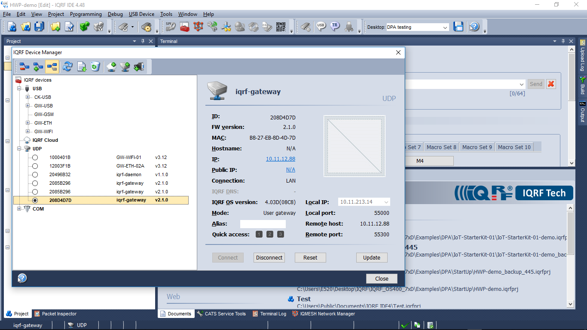

Service mode
============

Use the power of `IQRF IDE`_ and its IQMESH Network Manager to control your network. Connection 
to the gateway is via UDP channel.

Mode change
-----------

IQRF Gateway Webapp (/gateway/change-mode/) can be used to switch the gateway into **service** mode.
Mode switching can be also done via `management API`_.

Using IDE
---------

    IDE connection to the gateway.

* Select Mode: **User gateway**.

Using JSON API
--------------

Once you have finished working with IQMESH Network Manager switch the gateway back to **operational**
mode. Channels MQ/WS/MQTT are active in **operational** mode.

.. _`IQRF IDE`: https://iqrf.org/technology/iqrf-ide
.. _`management API`: https://apidocs.iqrf.org/iqrf-gateway-daemon/json/iqrf/examples/mngDaemon_Mode-request-1-0-0-example.json
