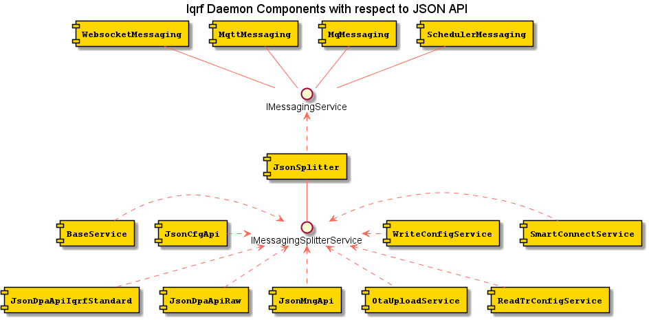
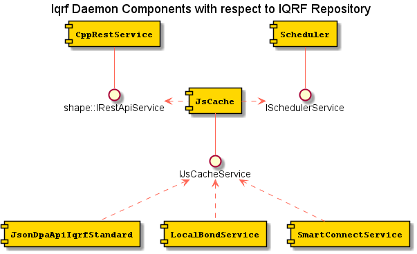
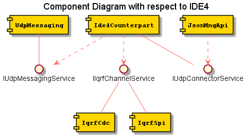

# Software design

## 1 Component design

Software design is based on [Shape](https://github.com/logimic/shape) component framework.
The framework itself is just a glue to put all components together. However it allows flexible adding of other features or redesign existing.  The business logic itself is implemented in components described in this document.
The framework is described in: [Shape/README.md](https://github.com/logimic/shape/blob/master/README.md). It follows basic principals as defines by these terms used in next text

**Module** is distributable software in form of shared library. Includes components data classes and logically merges related SW parts.

**Interface** is pure virtual (abstract) class containing methods (functions). Used parameters should be general not exposing implementation details.

**Component** is class which implements Interface. There can be more components implementing the same Interface. E.g. component logging to file and component logging into database. Both can implement the same Interface. Component may use other Interfaces implemented by other Components.

**Component Instance** is an object of a component created by the component constructor. Number of created Component Instances depends on an application configuration. E.g. file logging component can have three instances, one for critical errors, second for debug level and third for a specific component.

**Provided Interface** is running Component Instance implementing the Interface published to be used.

**Required Interface** is published placeholder for required Interface. If a Component Instance wants to use an Interface it publish the placeholder.

**Attach Interface** is delivering Provided Interface to Required Interface placeholder.

**Detach Interface** is withdrawal of Provided Interface to Required Interface placeholder.

**Interface Cardinality** is SINGLE or MULTIPLE. It means Required Interface instance can be attached just once or all instantiated Interfaces can be attached.

**Interface Optionality** is UNREQUIRED or MANDATORY. It means all MANDATORY Interfaces have to be attached.

**Interface Target** is UNREQUIRED or MANDATORY. It means all MANDATORY Interfaces have to be attached.

**Activate** is a Component Instance state when all MANDATORY Required Interfaces were attached and the instance is set by Shape to normal operation.

**Dectivate** is a Component Instance state when some of MANDATORY Required Interface was detached and the instance is set by Shape to stop normal operation.

**Service** is represented by its Interface. Provides service like doing command, send data, parse data, calculate data, registering call-back, etc. Service is a published Interface (Provided or Required) within Shape framework.

## 2 Interfaces & Components with respect to JSON API

Description of components processing messages received/sent via JSON API

### Interfaces
#### IMessagingService
Is abstraction of specific messaging protocol
- send message (address, message)
- register/unregister message handler (handlerId, handleFunction)
- get messaging ID name (string) 
- handleFunction(address, message)
- get flag if accepts async DPA message

#### IMessagingSplitterService
Is abstraction of messaging splitter. Incomming message is preparsed and the message is routed to proper handler according registered message type filters. When a message (response) is sent an implementation has to assure that it is routed back to proper messaging according messagingId 
- send message (messagingId, message)
- register/unregister message handler (vector< message filter>, handleFunction)
- handleFunction(messagingId, address, message) 

### Components
#### WebsocketMessaging
Implements IMessagingService Interface via Websockets protocol

#### MqttMessaging
Implements IMessagingService Interface via MQTT protocol

#### MqMessaging
Implements IMessagingService Interface via inter-process communication

#### SchedulerMessaging
Implements IMessagingService Interface delivering messages from Scheduler

#### JsonSplitter
It uses Required Interface IMessagingService to register a handler processing incoming request messages. JsonSplitter preparses the request messages to get a message type controlling where to route the next processing. It implements IMessagingSplitterService. A users of the interface is selected by matching the type and registered filters. The filter match if it is substring of incoming message type. It the type fits registered handler of the user is called. When the processing is finished the user sends back a response message. The response message is send according messagingId parameter. 

#### BaseService
This component is responsible for handling requests messages in format of daemon V1:
- Raw
- RawHdp

#### JsonCfgApi
This component is responsible for handling requests messages filtered by:
- cfgDaemon

#### JsonDpaApiIqrfStandard
This component is responsible for handling requests messages to perform an action with an embedded periphery and standard devices. It is responsible for messages filtered by:
- iqrfEmbed
- iqrfLight
- iqrfSensor
- iqrfBinaryoutput

#### JsonDpaApiRaw
This component is responsible for handling requests messages filtered by:
- iqrfRaw
- iqrfRawHdp

#### JsonMngApi
This component is responsible for handling requests messages filtered by:
- mngDaemon
- mngSched

#### OtaUploadService
This component is responsible for handling requests messages filtered by:
- TODO

#### ReadTrConfigService
This component is responsible for handling requests messages filtered by:
- TODO

#### SmartConnectService
This component is responsible for handling requests messages filtered by:
- TODO

#### WriteConfigService
This component is responsible for handling requests messages filtered by:
- TODO

## 3 Interfaces & Components with respect to DPA

Description of components acting in processing of DPA messages 

### Interfaces
#### IIqrfDpaService
Is abstraction of IqrfDpa Component (DPA Transaction, timing, error evaluation, etc.)
- execute Dpa Transaction
- get/set Dpa Transaction default timeout
- get/set RF mode (std/lp)
- register/unregister async message handler

#### IIqrfChannelService
Is abstraction of device driver providing connection to IQRF Coordinator
- send message
- get accessor with receive handler with normal, exclusive, sniffer access mode (for SW download/upload, for IDE4 cooperation)
- get state (ready, not ready, exclusive access)

### Components

#### BaseService
Processes legacy daemon V1 Raw and RawHdp messages, convert them to DPA messages and executes DPA transaction via IIqrfDpaService interface.
 
#### JsonDpaApiIqrfStandard
Processes Standard and Embed devices handling JSON API messges, convert them to DPA messages and executes DPA transaction via IIqrfDpaService interface.

#### JsonDpaApiRaw
Processes Raw and RawHdp JSON API messges, convert them to DPA messages and executes DPA transaction via IIqrfDpaService interface.

#### LocalBondService
TODO

#### OtaUploadService
TODO

#### ReadTrConfigService
TODO

#### SmartConnectService
TODO

#### WriteConfigService
TODO

#### Ide4Counterpart
TODO

#### IqrfDpa
Encapsulates DPA transaction processing via clibdpa and IIqrfChannelService as a channel to the coordinator

#### IqrfCdc
Implements IIqrfChannelService via CDC

#### IqrfSpi
Implements IIqrfChannelService via SPI

TODO: There shall be dedicated Component providing processing of asynchronous DPA messages. It is expected these messages could be send offen from asynchronous events from sleeping sensors (e.g. door open). I seems appropriate to analyze content and use right JS script to translate from DPA binary representation to user friendly format

## 4 Components with respect to IQRF Repository
TODO update

Description of components interacting with IQRF Repository

### Interfaces
#### shape::IRestClientService
Is interface providing generic REST API connection.

#### ISchedulerService
Is interface used to schedule periodic check of IQRF Repo state (new updates)

#### IJsCacheService
Is interface providing access to IQRF Repo cache
- gets package (HEX)
- gets JS drivers
- provides repo simple searches.
- gets all other repo related data.

### Components

#### Scheduler
Provides scheduled periodic task to check and download of possible repo new versions

#### CppRestService
Implementation of REST API client in Shapeware component collection.

#### JsCache
Downloads and holds repo cached data. Implements periodic repo check for new versions invoked as scheduled periodic task.

#### JsonDpaApiIqrfStandard
Encapsulates JS Engine implementation to interpret downloaded JS scripts to process Standard and Embed devices.

#### LocalBondService
TODO

#### SmartConnectService
TODO

## 4 Components with respect to upload

Description of components processing Upload

### Interfaces

#### IUploadService
Is abstraction of UploadService Component(loading code into modules on nodes)

#### INativeUploadService
Is abstraction of NativeUploadService Component(loading code into modules on nodes)

#### IDataPreparerService
Is abstraction of DataPreparerService Component(preparing data for UploadService
to load as code into modules on nodes)

### Components

#### UploadService
- writes code into external EEPROM memory
- loads code previously stored at external EEPROM memory to the MCU flash memory

#### NativeUploadService
- uploads data(configuration, Flash, internal and external EEPROM) to TR module 
  inside the USB device

#### DataPreparer
- parses files with code to upload into modules on nodes
- prepares input for UploadService Component

## 5 Components with respect to IDE4 connection (UDP)

Description of components processing IDE4 cooperation

### Interfaces

#### IIqrfChannelService
Interface to get direct access to the coordinator in Service mode and Sniffer access in Forwarding mode.

#### IUdpMessagingService
Interface to comunicate via UDP with IDE

#### IUdpConnectorService
Interface to expose Normal/Service/Forwarding mode switch via Json API

### Components

#### Ide4Counterpart
Process communication with IDE

#### UdpMessaging
Implements UDP based communication protocol with IDE

#### IqrfCdc
Implements IIqrfChannelService via CDC

#### IqrfSpi
Implements IIqrfChannelService via SPI

#### JsonMngApi
Process mngDaemon_Mode JSON API message to switch Normal/Service/Forwarding mode

--------

#### ISchedulerService
Provides Interface to Scheduler component
- Add periodic task (in seconds) for client id
- Add task with cron syntax for client id
- Get task by task id
- Remove task by task id
- List all tasks for client id
- Remove all tasks for client id

#### SchedulerMessaging
This component is responsible for handling requests messages to schedule tasks. The messages are in form of requests messages as it would be sent directly but wrapped in a scheduling envelope controlling postponing, periodicity, etc. JsonSched uses IScheduler interface to schedule the tasks. When it is fired by Scheduler JsonSched uses Provided Interface IMessaging to send wrapped request message via JsonHub to dedicated message handling component.
