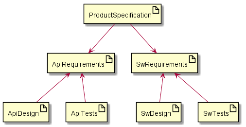

# Guidelines

## Documents flow



**Documents:**
- **[ProductSpecification](../01-Requirements/product-specification.md)** - high level product spec (like marketing reqs., data-sheet, etc..).
- **[ApiRequirements](../01-Requirements//api-requirements.md)** - detail API requirements.
- **[SwRequirements](../01-Requirements//sw-requirements.md)** - detail SW requirements.
- **ApiDesign** - UML and Doxygen design.
- **ApiTests** - testing of requirements.
- **[SwDesign](../02-Design/sw-design.md)** - UML and Doxygen design.
- **SwSpecificationTests** - testing of requirements.

**Rules:**
- Product spec numbering **SPEC-01**
- SwRequirements numbering **DEM-01, -02, ...**
- ApiRequirements numbering **API-01, -02, ...**
- **Linking:**
  - Requirements to Issues
  - Design to Requirements & Issue
  - Use relative links as shown in example:

  ```
  - **DEM-01** Modular core. [SPEC_01](../product-spec/product-spec.md#1-software-specification), [#2](https://gitlab.iqrfsdk.org/gateway/iqrf-daemon/issues/1)

    Basic module management core.
  ```
